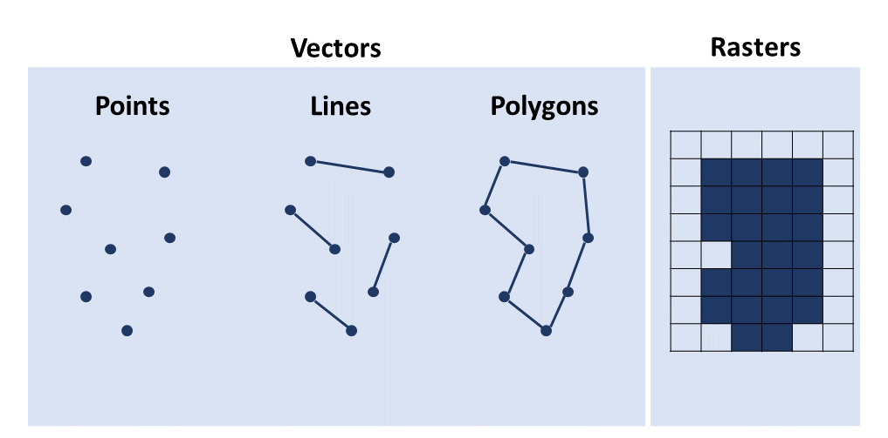

# Spatial data in R {#data-types}

The previous chapter presented concisely the focus of this book and what the reader would be able to achieve after reading it. This chapter will focus on the fundamentals of mapping, i.e. the different types of data that can be used to make a map. 

It is written for those with some knowledge of R and little experience with spatial data. If you are familiar with the different data types (points, lines, polygons and vectors), you may move on to the next chapter where visualisation of data types is explained in more detail. However you never know, you may learn something here too. 
<br/>

<style>
div.green { background-color:#e3ffd9; border-radius: 5px; padding: 20px;}
</style>
<div class = "green">
**Learning objectives**

- Be able to describe and use points, lines, polygons and raster data types
- Understand the difference between vector and raster data
- Know how to manipulate spatial data using packages `sf` for vector and `raster` for raster.
[andy: consider whether to replace `raster` with `terra` or `stars` above]
- Be comfortable visualising different spatial data types in R using packages `mapview` & `tmap`
</div>
<br/>

Maps are used for a wide range of purposes. In this book we focus on using maps to present data.

A map can provide a model of reality to help the reader see where things or events are located. This could be on the scale of a street, a neighbourhood, a country or a continent. Depending on the topics you're interested in, this could be focussed on disease cases, landcover dynamics, location of schools. The opportunities are endless. 

The data that we can represent on a map can be divided into four main types :

1. points
1. lines
1. polygons
1. rasters

Points can be used to represent the locations of e.g. cities, buildings, disease cases, sample sites or wildlife records. They can be used to represent the centre of an area. Points can be chosen when the shape of the location is not important. Thus for a map representing a continent, cities can be represented by points because the area of cities would not be visible. Lines may represent physical features such as rivers or roads, or routes travelled, or abstract links between point locations. Polygons are shapes that can represent the boundaries of countries, regions or cities or if you are zoomed in further the outline of buildings. Rasters are gridded datasets that can be used to represent anything that covers a continuous area, this could be temperature or estimates of population or landcover, most often they are derived from remote sensing and modelling.  

[andy work a bit more on previous paragraph]


All spatial data types require a coordinate reference system (CRS) identification to place data in the correct location on the Earth. We will discuss this in more detail later. For now, just be aware that a code may need to be entered to ensure that data display in the correct place. Note also that spatial data types can be stored in many different formats, from Shapefile (.shp + .dbf + .prj + …), to GeoPackage (.gpkg), to CSV files (.csv). To learn more about the possible spatial data types go to *Chapter 4: Getting your own data into R*.


## Points {#episode_1_points}

Let’s take an imaginary walk outside. What do you see? Houses, cars, trees… All these objects have unique coordinates that can be used to identify their location. On a map, the objects can be drawn as points with their latitude and longitude coordinate indicating their location in relation to other objects and places. Depending on the scale of your map, points can represent anything from a house, health clinic, city or district. You, as the map creator, can decide the scale of your own map.<br/>


### Example

Lets try and visualise the capital cities of Africa which we have stored in the `afrilearndata` package.

Just a quick reminder of the necessary packages 
```{r, warning=FALSE, message=FALSE}

library(afrilearndata) #load afrilearndata package

#In case the data isn't loaded into your R environment automatically, it can be loaded individually using the code below.
data(africapitals) #location of the African capitals

```

We will start by downloading the necessary packages:
*[sf](https://r-spatial.github.io/sf/) package. This package is necessary to read in the spatial data files. 
*[tmap](https://cran.r-project.org/web/packages/tmap/tmap.pdf) package. This package is necessary to create the maps. 
```{r, warning=FALSE, message=FALSE}

#install.packages("sf") #install sf package
#install.packages("tmap") #install tmap package
library(sf) #load sf package
library(tmap) #load tmap package

```

**Note** More information can be found about the different packages using the Help tools.

Now, let's look at the data file that contains information about the African capitals. A quick summary of the spatial aspects (geometry) of the datafile can be checked using the following code:
```{r, warning=FALSE, message=FALSE}

print(st_geometry(africapitals)) #printing information on the geometry

```
We can see from the results that the African capital data file contains 50 points (capitals) with geometry type **POINT**. 

Let's print the first 6 rows of data, so we can see how the coordinates of each African capital is stored in the database.
```{r, warning=FALSE, message=FALSE}

head(africapitals) #First 6 rows of data are printed

```
The capitals all have one latitude and one longitude value. The geometry of the point data is stored as *POINT (Latitude, Longitude)*. On the location where the latitude and longitude overlap, a point will be drawn when POINT data is visualised. There is also another column that contains the population of the capital.
 

Let's now visualise the African capitals by plotting their geometry using the tmap package.
```{r, warning=FALSE, message=FALSE, out.width="60%", fig.cap="The capital cities of Africa."}

tm_shape(africapitals) + #specify the data file
  tm_dots() # displaying the point geometry

```
The `tmap` package works similar to the ggplot package. You need to first specify the data file you want to visualise using `tm_shape()`, after which the exact format of the spatial data can be specified (points, lines, polygons). As we are working with point data in this example, the `tm_dots()` function is used. As with ggplot, there is a lot of flexibility in the colouring, shapes and sizes of the dots. For example, the dots can be turned red and labelled with the name of the city. 
```{r, warning=FALSE, message=FALSE, out.width="60%", fig.cap="The capital cities of Africa with customised dots."}

tm_shape(africapitals) +
  tm_dots("red")+ # displaying the point geometry as red dots
    tm_text("capitalname", size=0.7 ) #adding the name

```
As you can see in the example above, the labelling makes the image messy. In these instances it is important to think about the message you are trying to convey with your map. 
If the labelling is essential, you can look up the help section of the 'tm_text' using the help tool and play around with the different options to clean up the map further. 

<style>
div.purple { background-color:#e9d0f7; border-radius: 5px; padding: 20px;}
</style>
<div class = "purple">
**Exercise 1**: In this first exercise, we will use the same African capital data as our example. 
Below, we have visualised all capitals with > 1.400.000 people using green squares of size 1. However, the code is not working. Can you find the **four** mistakes? 

*Hint: if you get stuck, look at '?tm_dots'*

```{r, warning=FALSE, message=FALSE}

africapitals_filtered=africapitals %>%
 dplyr::filter((africapitals$iso3c) > 1400000)

tm_shape(africapitals_filtered) +
 tm_dots("green", size=0.5)

```
<br/>

**Exercise 2**: We will now use capital and African airport data.Visualise the capitals and airports in one map, with capitals as grey large filled-in circles and airports as smaller blue not-filled triangles.<br/> 
*Hint: if you get stuck, look at 'Add Points to a Plot' in the help section.*
*Hint: When both points and lines are mapped, datasets need to be identified seperately in `tm_shape()` before the use of `tm_dots()`.*
</div>  


## Lines {#episode_2_lines}

In previous episode we looked at point data, such as capitals and airports. We are often interested in how these different locations on a map are connected to each other. These connections are visualised using lines. Roads, rivers and flight paths are just a few of the many ways that lines are used. Lines are one dimensional data which are drawn using points (and thus point data) connected to each other in a set order. Depending on the detail of the lines, more or less point data are connected. <br/>

### Example

For this example, we will look at the trans-African highway network.
Let's start by looking at a quick summary of the spatial aspects (geometry).
```{r, warning=FALSE, message=FALSE}

print(st_geometry(afrihighway)) #printing information on the geometry

```
The results show that the African highway network contains 100 lines with geometry type **LINESTRING**.

Let's now print the first 6 rows of data to see how line data are stored.
```{r, warning=FALSE, message=FALSE}

head(afrihighway) #First 6 rows of data are printed

```
Line data contain a string of data points with latitude and longitude: *LINESTRING(Latitude1, Longitude1, Latitude2, Longitude2, Latitude3, Longitude3,.. )*. During mapping, these points are connected to form a line. 

Let's visualise these linestrings in red by plotting their geometry using the tmap package.
```{r, warning=FALSE, message=FALSE}

tm_shape(afrihighway) +
  tm_lines("red") 

```
 
Similar to point data, the lines can be illustrated in a large variety of ways. Please check the `tm_lines()` help section to familiarise yourself with the many layout options available. 

Now we add the capitals from previous episode in blue. 
```{r, warning=FALSE, message=FALSE}

tm_shape(africapitals) +
  tm_dots("blue", size=0.5)+
tm_shape(afrihighway) +
  tm_lines("red") 

```
It is great to see how the capitals are connected by the trans-African highway network.

**Note** The order of `tm_dots()` and `tm_lines()` matters. If you want the points overlaying the lines, it should be placed *after* the lines coding and visa versa.

<style>
div.purple { background-color:#e9d0f7; border-radius: 5px; padding: 20px;}
</style>
<div class = "purple">
**Exercise 3**: In the below exercise we have tried to visualise all the capitals and *only* the roads starting with the letter 'b'.
However, we have messed up the order of the code. Can you rearrange the code? 
```{r, eval=FALSE, warning=FALSE, message=FALSE}
afrihighway_ex1=afrihighway[grep("^B", afrihighway$Name),]

tm_shape(africapitals) +
  tm_dots("blue", size=0.5)+
    tm_shape(afrihighway_ex1)+
  tm_lines("blue")
```

**Exercise 4**: Visualise the trans-African highway network, with line width associated with the length of the road. The function `st_length` is used to calculate the length of a line.
</div> 


## Polygons {#episode_3_polygons}

Polygons are lines with the same first and last coordinate. When the polygon line is connected, the same start and end point results in a closed shape. Similar to lines, depending on the detail of the map, more or less points can be used to create a polygon. This two-dimensional data is most often used to visualise country and continent boundaries.   

The continent outline of Africa is a multipolygon.
```{r, warning=FALSE, message=FALSE, out.width="90%", fig.cap="An outline map of Africa."}

plot(st_geometry(africontinent), col = "lightblue")

```

One polygon is used to visualise the mainland of Africa. An additional polygon is used for Madagascar. Together they represent the whole African continent. 

Sometimes several polygons are necessary to capture a more complex shape. The different polygons in one data row indicate either areas to include or exclude from the final image. These are called multipolygons. 
An example of a multipolygon is the country border of South Africa. Lesotho is entirely surrounded by South Africa. If we want to visualise South Africa, we need to make sure that the Lesotho area is excluded. Visualisation of South Africa therefore requires two polygons, one to outline the outer borders and one to highlight the area to exclude (Lesotho country borders). 
Below, the South African border is visualised.
```{r, warning=FALSE, message=FALSE, out.width="60%", fig.cap="An outline map of South Africa."}

africountries_ex=africountries %>%
  filter(`name` == "South Africa")

plot(st_geometry(africountries_ex), col = "lightblue")

```

As you can see in the image, when the polygon of South Africa is visualised, a white area is visible inside the country (representing Lesotho), which is not part of South Africa. <br/>


### Example

For this example, we will look at the country borders of African countries. 
Let's visualise the geometry of the datafile first. 

```{r, warning=FALSE, message=FALSE}

print(st_geometry(africountries)) #printing information on the geometry

```

The country border file contains 51 country outlines with geometry type **MULTIPOLYGON**.

If we print the first 6 rows of data, we can see how each country border is stored in the database.

```{r, warning=FALSE, message=FALSE}

head(africountries) #First 6 rows of data are printed

```

Here, the geometry data contain a list with (multiple) polygons, with each polygon represented as a list of data points with latitude and longitude. These points are connected to form polygons, which are either used to include or exclude areas from the final image. The geometry of the multipolygon data is stored as *MULTIPOLYGON (((Latitude1, Longitude1, Latitude2, Longitude2, Latitude3, Longitude3,.. ),(Latitude1, Longitude1, ..)),(Latitude1, Longitude1, ...)))*. 

Lets visualise these multipolygons with black lines.

```{r, warning=FALSE, message=FALSE}

tm_shape(africountries) +
   tm_borders() #if only borders need to be visualised
 
tm_shape(africountries) +
   tm_polygons() #if you want the image to specify the multipolygon area

```

Now we can add the capitals and highways from earlier :

```{r, warning=FALSE, message=FALSE}

tm_shape(africountries) +
  tm_borders()+
tm_shape(africapitals) +
  tm_dots("blue", size=0.5)+
tm_shape(afrihighway) +
  tm_lines("red") 

```

<style>
div.purple { background-color:#e9d0f7; border-radius: 5px; padding: 20px;}
</style>
<div class = "purple">
**Exercise 5**: Multiple choice to identify if data files contain point, line or (multi)polygon geometry.

1. Look up the bus routes in your home area. Which data type would you use to visualise this data? 
* a. Point data
* b. Line data
* c. Multipolygon data
* d. All of the above

2. What kind of data type is necessary to visualise the countries part of the [the Economic Community of West African States (ECWAS)](https://www.ecowas.int/) community?

* a. Point data
* b. Line data
* c. Multipolygon data
* d. All of the above

3. Which data type is necessary for the authors to visualise the below image. 
(need help visualising this with the right approval from authors)
https://www.google.com/url?sa=i&url=https%3A%2F%2Fcdiac.ess-dive.lbl.gov%2Fepubs%2Fndp%2Fndp055%2Fndp055.html&psig=AOvVaw2qJ0HAjtU9ytbSWT-qFR0R&ust=1616679119758000&source=images&cd=vfe&ved=0CAIQjRxqFwoTCKD8l5qFye8CFQAAAAAdAAAAABBW
* a. Point data
* b. Line data
* c. Multipolygon data
* d. All of the above

**Exercise 6**: Visualise the African borders of all countries with an area larger than 300.000 km^2. The function `st_area` is used to calculate the area within a polygon. <br/>
*Hint: make sure you check the units*
</div> 


## Rasters {#episode_4_raster}
Points, lines and polygons, in their essence, consist of points with a longitude and latitude value. The data files of these vectors look very similar. Raster data are a group on their own. Raster data consist of a matrix of grid cells (pixels), with each grid cell representing a geographical location with a value illustrating a characteristic of that location. Raster data are mainly used when displaying data that are continuous across space. For example, population density, landcover variation and elevation data extracted from satellites, drones and surveys.  

The more grid cells a raster file contains, the smoother the visualisation of the characteristic will be. However, a large number of grids also means a large heavy file, which may be difficult to run. Whenever you are working with raster files, think about your goal and objective. The highest resolution might not always be necessary. 

To read in raster data, we first need to install and load the 'raster' package. 

```{r, warning=FALSE, message=FALSE}

#install.packages("raster") #install raster package
library(raster) # load raster package

```

We can now start visualising raster data.  <br/>

### Example

For this example we use African population data from 2000 and 2020. Let's look at the information within the file first.
```{r, warning=FALSE, message=FALSE}

print(afripop2000) #printing information on the raster data file

```

The population raster data from 2000 contains 434 rows, 413 columns and a total of 179242 grid cells with geometry type **RasterLayer **.


Let's print the first 10 rows of data. 

```{r, warning=FALSE, message=FALSE}

head(afripop2000) #First 6 rows of data are printed

```

Why do you think all rows are empty? 

You could use `getValues()` to look at all grid cell values, but that would take up a few pages of the book, so we won't do it here! 

```{r, eval=FALSE, warning=FALSE, message=FALSE}

getValues(afripop2000)

```

The printed matrix shows that the raster layer consists of a matrix with values. The grid cells can be empty if no data is available. This just results in no visualisation (NA or empty) at those locations. 

Lets visualise the population data with the country borders. Note that population density data are highly skewed. To ensure both high and low density areas are clearly visible, we have to specify the data breaks manually.  

```{r, warning=FALSE, message=FALSE}

tm_shape(afripop2020) +
    tm_raster(breaks=c(0,2,20,200,2000,25000))

```


We can make the image easier to interpret by using a palette from the [viridisLite](https://cran.r-project.org/web/packages/viridisLite/viridisLite.pdf) package, moving the legend using `tm_layout()` and including the African borders. 

```{r, warning=FALSE, message=FALSE}

tm_shape(afripop2020) +
    tm_raster(palette = rev(viridisLite::magma(5)), breaks=c(0,2,20,200,2000,25000)) + #specify the breaks of the palette
  tm_layout(legend.position = c("left","bottom"))+ #moves the legend to the left bottom corner
tm_shape(africountries) +
    tm_borders() 

```

Now we can add the capitals and highways from earlier : 

```{r, warning=FALSE, message=FALSE}

tm_shape(afripop2000) +
    tm_raster(palette = rev(viridisLite::magma(5)), breaks=c(0,2,20,200,2000,25000)) +
  tm_layout(legend.position = c("left","bottom"))+
tm_shape(africountries) +
    tm_borders() 

```

<style>
div.purple { background-color:#e9d0f7; border-radius: 5px; padding: 20px;}
</style>
<div class = "purple">

**Exercise 7**: Visualise the population data of 2000 using a different palette from the [viridisLite](https://cran.r-project.org/web/packages/viridisLite/viridisLite.pdf) package. Increase the number of breaks to six. Which breaks are most appropriate?
</div> 


## Further resources
If you are interested in learning more about the different spatial data types, please visit: 

- [Geospatial workshop](https://datacarpentry.org/geospatial-workshop/)

- [Geospatial data organization](https://datacarpentry.org/organization-geospatial/)

- [Introduction to geospatial data](https://datacarpentry.org/r-intro-geospatial/)

- [Raster and vector data](https://datacarpentry.org/r-raster-vector-geospatial/)


## Summary
The image below gives a short recap of the different data types discussed in this chapter. You should now be able to recognize, load and manipulate these data types using the `sf` and `raster` and visualise them using the `tmap` package.

```{r, fig.cap ="Summary of the chapter.", echo=FALSE}

```

## Exercise solutions

- Exercise 1
  * In the initial filter, `africapitals$iso3c` needs to be changed to `africapitals$pop`
  * Dots in 1.400.000 need to be removed
  * The shape of the dots need to be specified as squares using `shape=22`
  * The size of the points needs to be 1. 
  
```{r, warning=FALSE, message=FALSE}

africapitals_filtered=africapitals %>%
  dplyr::filter((africapitals$pop) > 1400000)

tm_shape(africapitals_filtered) +
  tm_dots("green", shape = 22, size=1)

```

- Exercise 2
```{r, warning=FALSE, message=FALSE}

tm_shape(africapitals) +
  tm_dots(col="grey", shape = 19, size=3) +
tm_shape(afriairports) +
  tm_dots(col="blue", shape = 2, size=1)

```

- Exercise 3
```{r, warning=FALSE, message=FALSE}

afrihighway_ex1=afrihighway[grep("^B", afrihighway$Name),]
tm_shape(africapitals) + #important that capitals are visualised first
  tm_dots("blue", size=0.5)+
    tm_shape(afrihighway_ex1)+
  tm_lines("blue")

```

- Exercise 4
```{r, warning=FALSE, message=FALSE}

afrihighway$length=tapply(st_length(afrihighway), afrihighway$Name)

tm_shape(afrihighway) +
  tm_lines(lwd = "length")

```

- Exercise 5

1. b
2. c
3. d

- Exercise 6

```{r, warning=FALSE, message=FALSE}

africountries$area_sqm <- st_area(africountries)
africountries$area_sqkm <-africountries$area_sqm / 1000000

africountries_filtered = africountries %>%
  dplyr::filter(as.numeric(africountries$area_sqkm) > 300000)

tm_shape(africountries_filtered) +
   tm_borders()

```

- Exercise 7

```{r, warning=FALSE, message=FALSE}

tm_shape(afripop2020) +
   tm_raster(palette = rev(viridisLite::plasma(6)), breaks=c(0,2,20,200,2000,20000, 25000)) +
 tm_layout(legend.position = c("left","bottom"))+
tm_shape(africountries) +
   tm_borders()

```