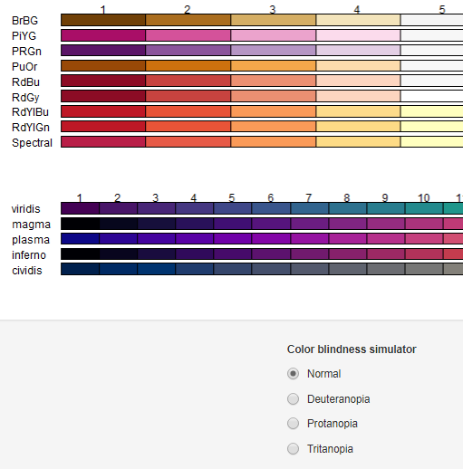

# Visualising spatial data part 1: tmap and mapview {#visualising1}

## Overall goal of the chapter
In the previous section we explored different types of spatial data and looked at how these can be used to create a map. In this section we will use `tmap` and `mapview` packages to create both static and interactive maps. In particular, we will focus on the goals presented below.

<style>
div.green { background-color:#e3ffd9; border-radius: 5px; padding: 20px;}
</style>
<div class = "green">
**Learning objectives**

- Create static and interactive maps using different packages
- Learn function structure to build more advanced maps
- Analyse the differences between used packages and identify their applicability for various purposes

</div>


This chapter requires the following packages (some of them we used already):

```{r, eval=FALSE}
cran_packages_to_install <- c(
  "mapview",           # map-making package for interactive maps
  "tmap",              # map-making package for static and interactive maps
  "tidyverse",         # metapackage containing dplyr, ggplot2 and other packages
  "sf",                # package for working with spatial data
  "tmaptools"          # map building package
  )
install.packages(cran_packages_to_install)
#remotes::install_github("afrimapr/afrilearnr")
remotes::install_github("r-spatial/mapview@develop")
remotes::install_github("afrimapr/afrilearndata")
```

Next, we need to load the packages:

```{r, results='hide', warning=FALSE, message=FALSE}
library(tmap)
library(mapview)
library(ggplot2)
library(sf)
library(afrilearndata)
library(dplyr)
library(tmaptools)
```

## Quick interactive maps with mapview
The `mapview package` allows you to quickly and easily create interactive maps using spatial data. Therefore, it is useful when we want to quickly explore the data visually without excessive care about the quality of the presentation. However, if you need static maps or interactive maps which are more elaborate you might want to consider other options such as `tmap package` which will be presented later in this chapter. <br/> 

Moreover, a potentially important aspect to consider is whether the map should be interactive at all. Even though powerful R packages allow us to produce interactive maps quickly and (nearly) effortlessly, it is important to align the purpose of the map with its appearance and functionality. This will ensure that the interactivity does not impede reader's interaction with the map and helps conveying key information easily. For example, it is important to consider target audience of the map. If the map is for the specialists then the interactivity will potentially help gaining more in-depth insights into the data and finding more detailed, micro-scale information, beyond the trends identifiable at first sight. However, if the map is published for broader audience to provide an overview of a certain situation easily and quickly, then a static map is probably a better medium. At the end of the day the features included in the map should help the author of the map communicate with the reader. Therefore, the type, functions and appearance of the map should be in line with the amount and level of information to be presented, the purpose of the map and the level of expertise of the reader.<br/>

As we now shortly discussed the advantages and disadvantages of using the interactive maps, let us have a look on the how they can be created. Firstly, it is important to say that the typical spatial objects types supported by `mapview` package are: 

- sf objects which is "*a collection of simple features that includes attributes and geometries in the form of a data frame*" [(Saddler, 2021)](https://www.jessesadler.com/post/simple-feature-objects/).
- raster data made of pixels, where each pixel represents a geographical location

To create the most basic, interactive map with the boundaries of African countries you need to call `mapview()` function

```{r c5-mapview-countries, warning=FALSE, message=FALSE}
 data(africountries)
 mapview(africountries)
```

This map has a number of functions:

- layer button to switch between five different layers
- scale bar
- zoom buttons
- data name in the top right corner

You can easily fill an interactive map with the colours based on one of the columns. Here we use population column to colours our map. Importantly, when you hoover over specific country the population data for a given country is showed.


```{r c5-mapview-countries2}
mapview(africountries, zcol = ("pop_est"))
```

Similarly, you can control for other features such as *line width* (lwd) or *colour of polygons* (col.regions). Another important feature that you might want to control is the underlying map which we set with *map.types* argument. The available background maps can be viewed [here](http://leaflet-extras.github.io/leaflet-providers/preview/).

```{r c5-mapview-countries3}
mapview(africountries, color = "red", 
      lwd = 1.5, col.regions = "white", map.types = "Esri.WorldShadedRelief")
```

Further, `mapview` allows you to easily build up many layers within a single map. Here, we firstly include countries and then add location of airports. Further a useful option is `layer.name` where you can control the naming of different layers of the map. The specific layers can be adjusted as showed in the example. In particular, we set the colour of countries polygons according to the population size. It is possible to use layer button to hide and unhide layers of the map.

```{r c5-mapview-airports}
# simple map with two layers
mapview(list(africountries, afriairports), layer.name = c("Countries", "Airports"))

#map with advanced layers options
mapview(africountries, zcol = "pop_est", layer.name = "Population") +
  mapview(afriairports, layer.name = "Airports location")
```

The link to full documentation is available in *Further resources* section. 

### Exercises
<style>
div.purple { background-color:#e9d0f7; border-radius: 5px; padding: 20px;}
</style>
<div class = "purple">
**Exercise 1**: Create a map with two layers: countries and capitals. Fill the country polygons according to income group. Explore the layers button to hide and unhide some of them.  
</div>   

## Static maps with tmap
In this section we explore the potential of `tmap` in creating static maps, which is a flexible, yet user-friendly package. Its syntax is similar to `ggplot2` (plot-making package), where additional features of the map are simply built up on top of the basic structure. Before you plot the first maps you need to activate static map viewing mode and (if necessary) read in your dataset.

```{r c5-tmap-countries1, message=FALSE}
tmap_mode("plot") #activates static map viewing mode
```

Next, we create an empty contour map of the continent, where `tm_shape()` function serves as a basic component containing the shape object i.e. our spatial dataset. On top of this basic element we can then add more layers using `+` operator. The advantage of `tmap` package is that it offers a large variety layers and these are named relatively intuitively to make the search and use easier. For example, we will now use layer called `tm_borders()` which defines the borders of the polygons. Further, we create an empty, border-less map using `tm_fill()` which defines the fill of the polygons. 

```{r c5-tmap-countries2, fig.show='hold', out.width="50%"}

tm_shape(africountries)+
 tm_borders()

tm_shape(africountries)+
 tm_fill()

```

Intuitively, to create a map with both layers, we need to include `tm_fill()` and `tm_borders()` simultaneously. Alternatively, `tm_polygons()` function allows you to achieve exactly the same result more efficiently. It draws the polygons borders and fills them at the same time. The choice of the approach will depend on type of data and information that you aim to present on your map. For example, if you plan to add a layer of road or rail network to your map later it may be a better idea to create a *base map* using polygons only (without contours) so that they do not overlap with road lines making the map more difficult to read.

```{r c5-tmap-countries4,fig.show="hold", out.width="50%"}

tm_shape(africountries)+
 tm_borders()+
  tm_fill()

tm_shape(africountries)+
 tm_polygons()

```

Nevertheless, we can further develop our map by adjusting different features of the map such as colour and transparency of the map, width and types of the border lines etc. This approach can also be used to help distinguishing different elements of the map. Following the example from above, the lines representing region borders and roads can be coloured differently to avoid confusion. The extra parameters for changing the plot elements can be found [here](http://publish.illinois.edu/johnrgallagher/files/2015/10/BaseGraphicsCheatsheet.pdf).


```{r c5-tmap-countries5, out.width="60%"}

tm_shape(africountries)+
 tm_polygons(col = "green", lty = "dotted", alpha = 0.3)

```

As you already know a basic structure required to build a static map, we can now proceed to a more advanced (and useful) example, where we fill the polygons using data on **last census** and add relevant title to the legend. Further, you can build on the previous map by adding labels for country names with `tm_text()` function. In a similar manner a variety of different layers can be added. Even though the possibilities are nearly endless, where large number of elements and layers can be combined in a single map, care should be take in order not to overwhelm the reader with the amount of information presented in one map and impede the clarity and readability of the map.

```{r c5-tmap-countries6, fig.show='hold', out.width="50%", fig.cap="Basic map without labels (left) and map with added coutries names (right)"}

tm_shape(africountries)+
 tm_polygons(col = "lastcensus", title = "Year of last census")+
  tm_layout(scale = 1.25) # increases the overall size of the legend

tm_shape(africountries)+
 tm_polygons(col = "lastcensus", title = "Year of last census")+
 tm_text("name", size = 0.52, fontface = "bold", auto.placement = TRUE)+
  tm_layout(scale = 1.25) 

```

Another useful function in `tmap` is the adjustment of the intervals in the legend, in case the default scale does not provide enough variety. For example, plotting the population of African countries on the map using default intervals (stemming from the data) is not very informative due to too much clustering of information. Instead, we might want to use `breaks` argument to set them up manually and provide more visual differentiation. For the transparency of the code, we set up the customised breaks outside of the map-making function. Alternatively, you can control number of so-called `bins` (groups) into which the **Population** is divided, by setting `n` argument to a desired number of bins inside the `tm_polygons()` function.

```{r c5-tmap-countries-breaks,warnings = FALSE, message = FALSE,out.width="50%"}
#default settings
tm_shape(africountries) +
                tm_polygons(col = "pop_est", title = "Population")

#set up breaks manually
custom_breaks = c(0, 1, 4, 7, 10, 30, 50, 70, 100, 120, 150, 180, 200) * 1000000
tm_shape(africountries) +
              tm_polygons(col = "pop_est", title = "Population", breaks = custom_breaks)

#set up a number of bins
tm_shape(africountries) +
            tm_polygons(col = "pop_est", title = "Population", n = 15) +
            tm_layout(scale = 0.9)


```

So far, we used continuous variables to fill the polygons but it is also possible to use categorical variables for this purpose. In the example below *income_grp* variable is a categorical variable that contains information about the income level. It allows for visual grouping of countries in the same category. The names of the categories in the legend were adjusted using `labels` argument. In the similar manner you can group and present the airports of Africa depending on their size.


```{r c5-tmap-countries-categorical, out.width="60%"}
tm_shape(africountries)+
  tm_polygons(col = "income_grp", title = "Income levels", alpha = 0.6,
              labels = c("High", "Upper middle", "Lower middle", "Lower"))+
                tm_layout(scale = 1.25)

data(afriairports)
tm_shape(africontinent)+
  tm_polygons(col = "lightyellow")+
tm_shape(afriairports) +
  tm_dots(col = "type", shape = 21, size = 0.2, title = "Airport size",
          labels = c("Large", "Medium", "Small"),
          palette=c(large_airport='red', medium_airport='yellow', small_airport='blue')) +
            tm_layout(scale = 1.25)

```

It is important to bear in mind that some information can be displayed on the map in many different ways. For example, we can make use of `tm_bubbles()` to create so-called bubbles which size is linked to the population of each country while their colour represents the income group of the country.


```{r c5-tmap-bubbles, out.width="60%"}
tm_shape(africountries)+
 tm_polygons(col = "lightyellow") +
  tm_bubbles(size = "pop_est", col = "income_grp", 
                    title.col = "Income level", title.size = "Population")

```

### Colour setting and colour pallete

An important aspect of the maps, as in every visual representation, are the colours. Beyond their aesthetic function, they come from a long tradition where they served as a primary mean to encode data on the maps. Consequently, they used to be called "visual variables" as they were a key for an accurate interpretation of the information on the map ([https://morphocode.com](https://morphocode.com/the-use-of-color-in-maps/)). It is, therefore, important to find the balance when using colours to not obscure the data. Following, morphocode.com, you should take into consideration three features of the colour, namely, its hue, saturation and lightness. Hue is the mental association of a given colour e.g. we associate blue with cold and red with hot. Next, saturation can be defined as colour intensity and lightness is a relative amount of light that seems to reflect from an object compared to white elements. These perceptual dimensions of the colours have their practical functions in map-making process. Typically, hue is used to demonstrate the categorical data so that each discrete category has a different colours e.g. green, blue and red. Secondly, scalar values (e.g. from the hottest to the coldest temperature) are usually well depicted using different colour lightness and saturation (e.g. from bright red to pale red). <br/>

Another important aspect in terms of colour use is the design of the map for the individuals with colour vision deficiency. They can differentiate between different lightness however specific colours used for different categories may be less accessible for them. The solution could be an addition of texture or usage of pallets which are colour-blindness friendly. In fact `tmaptools` allows for testing chosen map colours for three different types of colour blindness in its *color blindness simulator* (accessible via `tmaptools::palette_explorer()`), as seen in the Figure below.<br/>

```{r, out.width = "60%", echo=FALSE}

```

Moreover, `tmap` package has a broad colour selection, not only with respect to individual colours but also map styles where you can change the default colours using `palette` argument. In the example below, we used palette called *Set1* and *plasma* but there are many other options to choose from. To view them, in your console run `tmaptools::palette_explorer()` which will open a new window with a wide range of palettes. Sliders on the left hand side allow for selecting a number of colours.


```{r c5-tmap-palette, warning=FALSE, message = FALSE, results='hide', fig.cap = "Africa's maps using different pallete options."}

set1 = tm_shape(africountries)+
         tm_polygons(col = "lastcensus", title = "Year of last census", palette = "Set1")

plasma = tm_shape(africountries)+
          tm_polygons(col = "lastcensus", title = "Year of last census", palette = "plasma")

tmap_arrange(set1, plasma)

```

Alternatively, an overall style of a single map can be easily changed using `tm_style()` function. However, it might also be useful to change the style in all the maps in the document. This can be achieved with setting the style globally with `tmap_style("nameofthestyle")`. The default style is called "white", hence to restore a default style setting use `tmap_style("white")`. 

```{r, include = FALSE}
tmap_mode("plot")
```


```{r c5-tmap-style,message = FALSE, fig.cap = "Examples of different styles."}

classic = tm_style("classic")+
            tm_shape(africountries)+
              tm_polygons()+
                tm_bubbles(size = "pop_est", col = "income_grp", title.col = "Income level",
                  title.size = "Population", labels = c("High", "Upper middle", "Lower middle", "Lower"))+
                    tm_layout(scale = 0.8)

beaver = tm_style("beaver")+
          tm_shape(africountries)+
            tm_polygons()+
              tm_bubbles(size = "pop_est", col = "income_grp", title.col = "Income level",
                title.size = "Population", labels = c("High", "Upper middle", "Lower middle", "Lower"))+
                  tm_layout(scale = 0.8)

albatross = tm_style("albatross")+
            tm_shape(africountries)+
              tm_polygons()+
                 tm_bubbles(size = "pop_est", col = "income_grp", title.col = "Income level",
                  title.size = "Population", labels = c("High", "Upper middle", "Lower middle", "Lower"))+
                    tm_layout(scale = 0.8)

tmap_arrange(classic, beaver, albatross)

```

### Visualising different datasets in a single map
The `tmap` package not only allows you to add extra layers to a single map by building on a basic structure, but it also enables you to join two separate datasets in a single map. We, first, create an object called *countries* which is a map with African countries:
```{r c5-tmap-combine1, warning=FALSE, out.width="60%"}
#read in data
data(africountries)
#create an object
countries = tm_shape(africountries)+
  tm_polygons(col = "lightblue", alpha = 0.3)
#view object called "countries"
countries
```

Then we use it as an argument to merge it with a map containing the location of capitals.

```{r c5-tmap-combine2, warning=FALSE, out.width="60%"}
#read in data with capitals
data(africapitals)
#merge two maps
countries+
  tm_shape(africapitals)+  #uses dataset with capitals
    tm_dots(col = "red", size = 0.15)+       #adds dots on the map
      tm_layout(title = "Capital cities of Africa" , title.position = c("right", "top"), title.size = 1) #add and adjust map title

```

### Exercises
The solution to the exercises are provided at the [end of the chapter](#solutions_ch4).

<style>
div.purple { background-color:#e9d0f7; border-radius: 5px; padding: 20px;}
</style>
<div class = "purple">
**Exercise 2**: Plot a yellow map of Africa with transparency of 0.4 and solid line borders of width 3. 
</div>   
<br/>
<style>
div.purple { background-color:#e9d0f7; border-radius: 5px; padding: 20px;}
</style>
<div class = "purple">
**Exercise 3**: Plot a lightblue map of Africa with dotted, non-transparent, red borders.
</div>  
<br/>
<style>
div.purple { background-color:#e9d0f7; border-radius: 5px; padding: 20px;}
</style>
<div class = "purple">
**Exercise 4**: Plot a map that has polygons filled with gross domestic product, black borders, legend titled "GDP" and customised breaks at 0, 20000, 30000, 40000, 50000, 100000, 200000, 300000, 500000.
</div>  
<br/>
<style>
div.purple { background-color:#e9d0f7; border-radius: 5px; padding: 20px;}
</style>
<div class = "purple">
**Exercise 5**: Create a map with continent contour in light green colour. Then add African highways by using *afrihighway* dataset. Finally, include a title on the bottom of the map. 
</div>  

### Visualising subsets of data
So far we visualised whole datasets, now let's assume that we are only interested in the subset of our data, for instance, a specific country or the airports of a specific size only. In this section we will present two ways of subsetting **attribute-based subsetting** and **spatial subsetting**.

#### Attribute subsetting
We can achieve it using `dplyr` package which offers a function `filter()` to subset rows within the dataset. We present how this can be achieved on an example, where we aim to create a subset of data containing only large airports. Consequently we `filter` them based on their size. This process of subsetting can be decomposed into smaller steps. Firstly, we create a new dataset called *large_airports* which is based on the subset of data from the original dataset called *afriairports*. The data is subset using so-called pipe operator ` %>% ` that essentially links two arguments in the sequence. Here, ` %>% ` links our original dataset with the subsequent function `filter()`. The `filter()` function allows us to subset variables or dataset that meet our condition specified inside it. Specifically, we selected all the airports from the whole dataset which are large, based on the  *type* variable which contains *large_airport* observations that correspond to our airports of interest (large ones).<br/>

Next, we simply visualise two datasets in a single map. In the first step, we use *africountries* inside the `tm_shape()` function to create a base map of Africa. We specify that borders should be displayed with `tm_borders()`. In the second step we add new *large_airports* dataset with `tm_shape(large_airports)` and we specify that airport (from the *large_airports* dataset) should be visualised as red dots `tm_dots(col = "red")`.

```{r c5-tmap-subset}
tmap_mode("view")
data(afriairports)

#take a subset of data
large_airports = afriairports %>% filter(type=="large_airport")

#plot the subset
tm_shape(africountries)+
  tm_borders()+
  tm_shape(large_airports)+
    tm_dots(col = "red")

```

Another useful, subsetting example may be to visualise only information for one, specific country. This can be done using similar approach as presented above. In our example, we will focus on presenting airports of Egypt. Firstly, we take the dataset that contains all the airports (3348 observations in total) and create a new dataset called *egypt* which contains only the airports located in Egypt (66 observations in total). In the second step we create a map of the whole Africa coloured in beige and then overlay the Egyptian airports as blue dots.

```{r c5-tmap-subset-2}
tmap_mode("plot")

egypt = afriairports %>% filter(country_name == "Egypt")

tm_shape(africountries)+
  tm_polygons("beige")+
  tm_shape(egypt)+
  tm_dots(col = "blue")

```

It is also possible to visualise the different sizes of airport in the subset data. It is done exactly the same way as in the case of the whole dataset, where the colour of the dots are set to column name that contains the size of the airport. The code within `tm_dots()` function adjusts the colour and size of the airport dots and adds the legend.


```{r}
tm_shape(africountries)+
  tm_polygons(col = "lightyellow")+
  tm_shape(egypt) +
tm_dots(col = "type", shape = 21,size = 0.1, title = "Airport size",
        labels = c("Large", "Medium", "Small"),
        palette=c(large_airport='red', medium_airport='yellow', small_airport='blue'))
```

However, it can also be observed that the view of the map is quite zoomed out and some of the airports overlap. A possible solution to this problem would be to subset both, airports of Egypt as well as the country borders so that only map of Egypt is visible. This allows for taking a closer look at location of the Egyptian airports. The rest of the code is identical to that above. The additional component of `tm_layout()` is used to control the position of the legend of the map. It is needed here as the legend was overlapping with the map in the default position (bottom, left corner).<br/>

```{r}

egypt_map=africountries %>%
  filter(`name_long` == "Egypt")

tm_shape(egypt_map)+
  tm_polygons(col = "lightyellow")+
  tm_shape(egypt) +
  tm_dots(col = "type", shape = 21, size = 0.2, title = "Airport size",
          labels = c("Large", "Medium", "Small"),
          palette=c(large_airport='red', medium_airport='yellow', small_airport='blue'))+
    tm_layout(main.title = "Egypt", main.title.position = c("center", "top"), legend.position = c("right", "top"),)
```

#### Spatial subsetting

Another interesting way to subset that data is spatial subsetting which allows us to achieve similar results as above, when we do not have an attribute in the dataset that could be used for attribute-based subsetting. Spatial subsetting enables us to select information in one dataset (e.g. road network, rivers, airports cities ) given the spatial information from another dataset, given that both datasets cointain them. 

Below, we again choose Egypt as our example but any other country from the dataset can be used instead (see exercise below). For the ease of use, we create a variable *country_name* that contains our chosen country. We then, create *country_polygon* variable which subsets our chosen country based on *country_name*. It can, subsequently, be used in combination with other datasets to subset them based on spatial information that both contain. For instance, we subset airports of Egypt using spatial data of this country contained in *country_polygon*. In particular, *country_airports* data frame is created where spatial condition for subsetting (*country_polygon*) is provided in square brackets and target dataset (that contains data to be subset) is defined in front of it. In a similar manner the Egyptian highways can be subset. The airports and highways of Egypt are later visualised on two separate maps using `tmap` as we did before.

```{r, message=FALSE, warning=FALSE}
#Setting country name to the country of interest
country_name = "Egypt"

#Choosing spatial information of the country of interest
country_polygon = africountries %>% filter(name == country_name)

#Spatial subset of airports
country_airports = afriairports[country_polygon, ]

#Spatial subset of highways
country_highway <- afrihighway[country_polygon, ]

#Visualise airports of Egypt
tm_shape(country_polygon)+
  tm_polygons()+
tm_shape(country_airports)+
  tm_dots()

#Visualise highways of Egypt
tm_shape(country_polygon)+
  tm_polygons()+
tm_shape(country_highway)+
  tm_lines()

```

#### Exercises

<style>
div.purple { background-color:#e9d0f7; border-radius: 5px; padding: 20px;}
</style>
<div class = "purple">
**Exercise 6**: Using the example above create maps of highways and airports for two other countries of Africa.
</div>  


#### Subsetting with st_bbox() function

Alternatively, it is also possible to zoom the map in by cropping it along the coordinates. This can be done using `st_crop()` function where we need to specify boundary longitude and latitude in degrees along which the map will be clipped. We can obtain the boundary coordinates of our map by running `st_bbox()` function. We then specify arbitrary values along which we want to split the map in the `st_crop()` function where the min and max x correspond to longitude values and max and min y correspond to latitude. We present how this can be done in the example below where we focus only on the Western Africa.

```{r, warning=FALSE, message=FALSE}
st_bbox(africontinent)

west <- st_crop(africountries, xmin = -17, xmax = 21,
                          ymin = -25, ymax = 21)
tm_shape(west)+
  tm_polygons()


```


Similarly, it is possible to subset airport depending on their location. In the example below we aim to split African airport into four regions: north, south, east and west. 

```{r, warning=FALSE, message=FALSE}
west_airports <- st_crop(afriairports, xmin = -17, xmax = 21,
                ymin = -25, ymax = 21)

east_airports <- st_crop(afriairports, xmin = 22, xmax = 50,
                ymin = -25, ymax = 21)

south_airports <- st_crop(afriairports, xmin = 15, xmax = 35,
                ymin = -34, ymax = -25)

north_airports <- st_crop(afriairports, xmin = -16, xmax = 37,
                 ymin = 20, ymax = 37)

w = tm_shape(africontinent)+
  tm_polygons()+
  tm_shape(west_airports)+
  tm_dots()


e = tm_shape(africontinent)+
  tm_polygons()+
  tm_shape(east_airports)+
  tm_dots()

n = tm_shape(africontinent)+
  tm_polygons()+
  tm_shape(north_airports)+
  tm_dots()

s = tm_shape(africontinent)+
  tm_polygons()+
  tm_shape(south_airports)+
  tm_dots()

tmap_arrange(n,s,e,w)

```


Subsequently, they can be visualised on a single map and differentiated by a colour. This requires a base map with a continent shape and repetitive addition on all the layers with airports.


```{r, warning=FALSE, message=FALSE}
tm_shape(africontinent)+
  tm_polygons()+
tm_shape(south_airports)+
  tm_dots(col = "red")+
tm_shape(north_airports)+
  tm_dots(col = "blue")+
tm_shape(east_airports)+
  tm_dots(col = "green")+
tm_shape(west_airports)+
  tm_dots(col = "yellow")

```


Finally, to control for the zoom-in level it is also possible to use an interactive map to freely zoom in and out. This will be presented in the following section of the book.

## Interactive maps with tmap
The `mapview` is not the only package that allows us to produce interactive maps. Another possibility is the `tmap` package that offers versatility not only for creating static maps, as we have seen above, but it also allows for making customised interactive maps conveniently, by simply changing the mode of operation from static to dynamic using *plot* or *view*, respectively in `tmap_mode()` function. After the activation of an interactive mode all the maps produced with `tmap` will be interactive. Therefore, we are able to create all the maps that we have produced so far in an interactive version.


```{r c5-tmap-interactive, warning=FALSE}
#sets interactive mode
tmap_mode("view")

tm_shape(africountries)+
  tm_borders()+
    tm_shape(africapitals)+
    tm_dots(col = "white", border.col = "blue", size = 0.1)+ #capital dots settings
    tm_text("capitalname")+ #adds capital names
        tm_shape(afrihighway)+
    tm_lines(col = "red", lwd = 2, alpha = 0.7) #highway lines setting

```

Regardless of the mode, the creation of maps using `tmap` package is easy and convenient. The additional feature in the interactive mode is the choice of the background map. This can be set up using function `tm_basemap`. The available base maps can be accessed using `leaflet::providers`. They can also be previewed [here](https://leaflet-extras.github.io/leaflet-providers/preview/). In the example below, we use a topographic map of Africa. 


```{r c5-tmap-basemap}
tm_basemap("OpenTopoMap")+
tm_shape(africountries)+
  tm_borders()+
    tm_shape(africapitals)+
    tm_dots(col = "black")+ #capital dots settings
        tm_shape(afrihighway)+
    tm_lines(col = "red", lwd = 2, alpha = 0.7) #highway lines setting

```


Finally, we arrive to visualisation of subset of data in an interactive mode. This only requires change of the view mode similar to examples above.


```{r c5-tmap-interactive-subset}

tm_shape(africountries)+
  tm_polygons()+
  tm_shape(egypt) +
tm_dots(col = "type", shape = 21, size = 0.2, title = "Airport size",
        labels = c("Large", "Medium", "Small"),
        palette=c(large_airport='red', medium_airport='yellow', small_airport='blue'))
```

### Exercises

<style>
div.purple { background-color:#e9d0f7; border-radius: 5px; padding: 20px;}
</style>
<div class = "purple">
**Exercise 7**: Create an interactive map uses watercolour theme, the highways are blue and dots denoting capitals are white with black borders. Finally, add capitalnames.
</div>  
<br/>
<style>
div.purple { background-color:#e9d0f7; border-radius: 5px; padding: 20px;}
</style>
<div class = "purple">
**Exercise 8**: Create an interactive map of African countries which have population smaller than 10 million. Fill the polygons with the population size.
</div>  

## Further resources
- [tmap documentation](https://cran.r-project.org/web/packages/tmap/tmap.pdf)
- [Mapview documentation](https://r-spatial.github.io/mapview/articles/)

## Summary
In  this chapter we looked at how to produce static and interactive maps using different packages. Specifically, we saw that the `tmap` package is a flexible tool to create maps with a stepwise approach, where we can add different layers to our maps. It is equally easy to switch between static and interactive maps. Further, `mapview` was showed to be a quick solution for creating interactive maps.


## Exercise solutions {#solutions_ch4}
```{r, include = FALSE}
tmap_mode("plot")
```

- Exercise 1

```{r c5-ex-5.2.1, out.width="60%"}
mapview(africountries, zcol = "income_grp") + mapview(africapitals)
```

- Exercise 2
```{r c5-ex-5.3.1, out.width="60%"}
 tm_shape(africountries)+
  tm_polygons(col = "yellow", lwd = 3, lty = "solid", alpha = 0.4)
```

- Exercise 3
```{r c5-ex-5.3.2, out.width="60%"}
tm_shape(africountries)+
 tm_fill(col = "lightblue")+
 tm_borders(col = "red", lty = "dotted", alpha = 1)
```

- Exercise 4
```{r c5-ex-5.3.3, out.width="60%"}
custom_breaks = c(0, 2, 3, 4, 5, 10,20, 30, 50) * 10000
tm_shape(africountries)+
 tm_polygons(col = "gdp_md_est", title = "GDP",  breaks = custom_breaks)
```

- Exercise 5
```{r c5-ex-5.3.4, out.width="60%"}
map_contour = tm_shape(africountries)+
  tm_fill(col = "lightgreen")
data(afrihighway)
map_contour +
  tm_shape(afrihighway)+
  tm_lines()+
  tm_layout(title = "Highways in Africa", title.position = c("center", "bottom"))

```

- Exercise 6
```{r}
#Example country: Nigeria

country_name = "Nigeria"
country_polygon = africountries %>% filter(name == country_name)

#Spatial subset of airports
country_airports = afriairports[country_polygon, ]

#Spatial subset of highways
country_highway <- afrihighway[country_polygon, ]


tm_shape(country_polygon)+
  tm_polygons()+
tm_shape(country_airports)+
  tm_dots()


tm_shape(country_polygon)+
  tm_polygons()+
tm_shape(country_highway)+
  tm_lines()

```


- Exercise 7

```{r c5-ex-5.4.1, out.width="60%"}
tmap_mode("view")


tm_basemap("Stamen.Watercolor")+
tm_shape(africountries)+
  tm_borders()+
    tm_shape(africapitals)+
    tm_dots(col = "white", border.col = "black")+ #capital dots settings
    tm_text("capitalname", size = 1.2)+
        tm_shape(afrihighway)+
    tm_lines(col = "blue", lwd = 3) #highway lines setting

```

- Exercise 8

```{r c5-ex-5.4.2}
tmap_mode("view")
data(africountries)

#take a subset of data
small = africountries %>% filter(pop_est < 10000000)

tm_shape(small)+
  tm_polygons(col = "pop_est")

```
