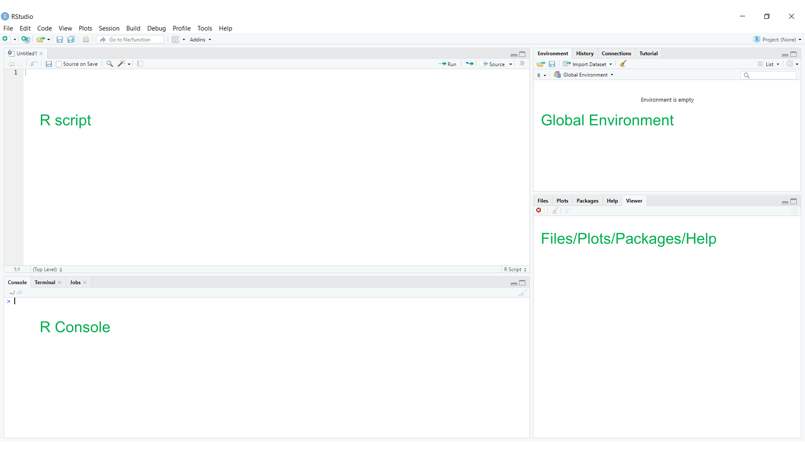
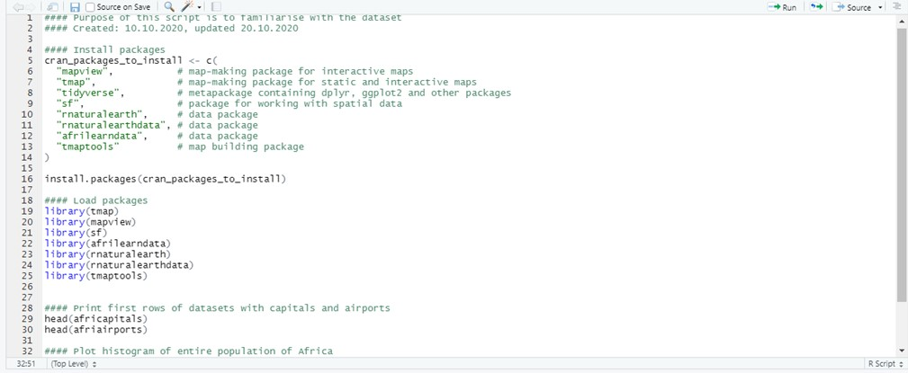

--- 
title: "The afrimapr book"
author: "The afrimapr team"
date: "`r Sys.Date()`"
site: bookdown::bookdown_site
output: bookdown::gitbook
documentclass: book
bibliography: [book.bib, packages.bib]
biblio-style: apalike
link-citations: yes
github-repo: afrimapr/afrimapr-book
description: "An introduction to making maps from African data in R."
---

# Welcome {-}

```{r, echo=FALSE}

```

This is the in-progress book introducing map making in R using African data. We aim to make a first version available in mid 2021.

It is part of the [afrimapr](https://afrimapr.github.io/afrimapr.website/) project running in 2020-21.

The book is compiled from this [repository.](https://github.com/afrimapr/afrimapr-book)

We welcome contributions, please [get in touch](https://afrimapr.github.io/afrimapr.website/get-involved/) or submit a github issue.


# Preface {-}

[code in index.Rmd]

In-progress chapters

1. Intro : aims of this book \@ref(intro)
1. Step through a simple example of process of mapmaking \@ref(taster)
1. R recap - help ensure readers know foundations \@ref(rrecap)
1. Spatial data types focusing on examples \@ref(data-types)
1. Visualising spatial data part 1 : sf, mapview, tmap \@ref(visualising1)
1. Shiny interactive map applications \@ref(shiny)
1. Sources of data, what is open data \@ref(data-sources) 
1. Join non-spatial data onto spatial \@ref(joining)
1. Raster manipulation, e.g. summarising data by areas \@ref(raster)
1. OpenStreetMap data, what they are and how to use \@ref(openstreetmap)
1. Creating and editing spatial data \@ref(data-editing)
1. Visualising spatial data part 2, more advanced techniques \@ref(visualising2)
1. Case study 1 : health facility locations \@ref(case-study1)
1. Case study 2 \@ref(case-study2)


The version of the book you are currently reading was last updated at:

```{r}
Sys.time()
```


```{r include=FALSE}
# automatically create a bib database for R packages
knitr::write_bib(c(
  .packages(), 'bookdown', 'knitr', 'rmarkdown'
), 'packages.bib')
```

<!--chapter:end:index.Rmd-->

# Introduction {#intro}

[andy: we may move this text to the Preface later (coded in index.Rmd), but is more difficult to find there.]

## Why read this book

[mention reproducibility, html, markdown, QGIS etc.]

Read this book if you would like to be able to make maps from African data (or indeed other data too).


## Who for

The book is aimed principally at analysts who want to make maps from African data as a part of their routine work. We expect that readers will have had some limited experience of R and/or spatial data but this is not strictly required. We will take you step-by-step through code to obtain, manipulate and visualise spatial data. We focus on routine tasks and developing confidence and resilience in applying them, rather than moving to more advanced analyses.

## What this book will not cover

For those that are interested in spatial analyses we refer you to the excellent recent book [Geocomputation with R](https://geocompr.robinlovelace.net/). The afrimapr book, in comparison, will cover fewer processes but do so in more detail and assuming less prior knowledge of R and spatial data. We see the two books as being complementary. Those that wish to take their work further after this afrimapr book should find the geocompr book useful. Those that have been through the geocompr book and would like more detail on visualising varied data sources in R should find this afrimapr book useful. 

## How the book is organised
[recap, taster chapters etc.]

## Book formatting
[exercise blocks, learning objectives etc.]

<!--chapter:end:01-intro.Rmd-->

# A taster - making your first map  {#taster} 

This chapter shows the steps through an example process of map-making. It demonstrates the focus and potential of this book, so that the readers can quickly see what this book aims to achieve and how it is done. 


```{r, c2-packages, results='hide', warning=FALSE, message=FALSE, include = FALSE, eval=FALSE}
#Install packages
cran_packages_to_install <- c(
  "ggplot" ,           # plot-making package
  "tmap",              # map-making package for static and interactive maps
  "tidyverse",         # metapackage containing dplyr, ggplot2 and other packages
  "sf",                # package for working with spatial data
  "s2",                # package for working with spatial data
  "tmaptools",         # map building package
  "raster"
  )

install.packages(cran_packages_to_install)
remotes::install_github("afrimapr/afrilearndata")
```

```{r, c2-libraries, results='hide', warning=FALSE, message=FALSE, include = FALSE}
#Load packages
library(tmap)
library(ggplot2)
library(sf)
library(s2)
library(afrilearndata)
library(dplyr)
library(tmaptools)
library(raster) 
```

```{r c2-dataset, include=FALSE}
#static mode activated
tmap_mode("plot")

```

## Simple maps
```{r c2-simple-map, message=FALSE, warning=FALSE}

sf_use_s2(FALSE) #switches off spherical geometry, needed after sf package update


map_1 = tm_shape(africountries) +
    tm_polygons()

map_2 = tm_shape(africountries) +
    tm_polygons(col = "pop_est", title = "Population")

map_3 = map_1 +
  tm_shape(afrihighway) +
    tm_lines(col = "blue")

tmap_arrange(map_1, map_2, map_3)

```

## Static maps
```{r c2-empty-static-map1,message=FALSE, fig.cap = "Examples of maps"}

#Create an empty map of Africa using a classic style
map_basic = tm_style("classic")+
tm_shape(africountries)+
 tm_polygons()+
  tm_layout(title = "Africa", title.position = c("center", "top"),
            inner.margins = 0.05, legend.text.size = 0.47)

#Add points for medium airports
data(afriairports)
m_airports = afriairports %>% filter(type == "medium_airport")

map_points = map_basic +
  tm_shape(m_airports)+
    tm_dots(col = "type", palette="blue",
            labels = "Medium airports", title = "")+
      tm_legend(legend.position = c("left", "bottom")) +
        tm_layout(scale = 1.07)


#Add bubbles with population and GDP size
map_bubbles = map_points +
       tm_shape(africountries)+
          tm_bubbles(size = "pop_est", col = "income_grp", title.col = "Income level",
              title.size = "Population",
              labels = c("High", "Upper middle", "Lower middle", "Lower"))


tmap_arrange(map_basic, map_points, map_bubbles)

```

```{r c2-empty-static-map2, warning = FALSE, message=FALSE, fig.cap = "Examples of maps 2"}

#Basic map 2
map_basic_2 = tm_style("watercolor")+
  tm_shape(africountries)+
      tm_fill(col = "pop_est", style = "jenks", title = "Population")+
        tm_layout(title = "Africa",
                  title.position = c("center", "top"), legend.text.size = 0.50)

#Add highways names
map_highways = map_basic_2 +
  tm_shape(afrihighway)+
              tm_lines(col = "black")

#Add country names
map_named = map_highways +
  tm_shape(africapitals)+
      tm_dots(col = "red", border.col = "black")+
          tm_text("capitalname",  size = 0.35)


tmap_arrange(map_basic_2, map_highways, map_named)

```

## Interactive maps
```{r c2-interactive_map, fig.show="hold", out.width="50%"}
tmap_mode("view")

breaks=c(0,2,20,200,2000,25000)

tm_shape(afripop2020) +
    tm_raster(breaks=breaks, title = "Population per km sq") +
tm_shape(afrihighway) +
    tm_lines(col = "blue") +
tm_shape(africapitals) +
    tm_dots(col = "black", alpha=0.5)
```

<!--chapter:end:02-taster.Rmd-->


# Spatial data in R {#data-types}

The previous chapter provided a short recap of the R basics that will help you progress through this book. This chapter will focus on the fundamentals of mapping, i.e. the different types of data that can be used to make a map. 

This chapter is written for those with some knowledge of R and little experience with spatial data. If you are familiar with the different data types (points, lines, polygons and vectors), you may move on to the next chapter where visualisation of data types is explained in more detail. However you never know, you may learn something here too. 
<br/>

<style>
div.green { background-color:#e3ffd9; border-radius: 5px; padding: 20px;}
</style>
<div class = "green">
**Learning objectives**

[andy: still thinking how best to structure these]

- Be able to describe and use points, lines, polygons and raster data types
- Understand the difference between vector and raster data
- Be able to read in data of the 4 types into R from files and other sources
- Know that the current best packages for manipulating spatial data are package `sf` for vector and package `raster` for raster.
- Be comfortable visualising the four different spatial data types in R using packages `mapview` & `raster`
</div>
<br/>

Maps are used for a wide range of purposes. In this book we focus on using maps to present data.

A map can provide a model of reality to help the reader see where things or events are located. This could be on the scale of a street, a neighbourhood, a country or a continent. Depending on the topics you're interested in, this could be focussed on disease cases, landcover dynamics, location of schools. The opportunities are endless. 

The data that we can represent on a map can be divided into four main types :

1. points
1. lines
1. polygons
1. rasters

Points can be used to represent the locations of e.g. cities, buildings, disease cases, sample sites or wildlife records. They can be used to represent the centre of an area. Points can be chosen when the shape of the location is not important. Thus for a map representing a continent, cities can be represented by points because the area of cities would not be visible.

Lines may represent physical features such as rivers or roads, or routes travelled, or abstract links between point locations.

[andy to continue ...]


All spatial data types require a coordinate reference system (CRS) identification to place data in the correct location on the earth. We will discuss this in more detail later. For now, just be aware that a code may need to be entered to ensure that data display in the correct place. Note also that spatial data types can be stored in many different formats, from Shapefile (.shp + .dbf + .prj + …), to GeoPackage (.gpkg), to CSV files (.csv). This can be overwhelming at times. Don't worry we will come to these later [Andy great if we can specify exactly where this information can be found]. 


### List of episodes {-}
1. [Points (cities)](#episode_1_points)
2. [Lines (roads)](#episode_2_lines)
3. [Polygons (country boundaries)](#episode_3_polygons)
4. [Rasters (population density)](#episode_4_raster)


## Points {#episode_1_points}

Let’s take an imaginary walk outside. What do you see? Houses, cars, trees… All these objects have unique coordinates that can be used to identify their exact location. On a map, the objects can be drawn as points with their latitude and longitude coordinate indicating their exact location in relation to other objects and places. Depending on the scale of your map, points can represent anything from a house, health clinic, city or district. You, as the map creator, can decide the scale of your own map.<br/>


### Example

Lets try and visualise the capital cities of Africa which we have stored in the `afrilearndata` package.

Just a quick reminder of the necessary packages 
```{r, warning=FALSE, message=FALSE}

library(afrilearndata) #load afrilearndata package

#In case the data isn't loaded into your R environment automatically, it can be loaded individually using the code below.
data(africapitals) #location of the African capitals

```

We will start by downloading the necessary packages:
*[sf](https://r-spatial.github.io/sf/) package. This package is necessary to read in the spatial data files. 
*[tmap](https://cran.r-project.org/web/packages/tmap/tmap.pdf) package. This package is necessary to create the maps. 
```{r, warning=FALSE, message=FALSE}

#install.packages("sf") #install sf package
#install.packages("tmap") #install tmap package
library(sf) #load sf package
library(tmap) #load tmap package

```

**Note** More information can be found about the different packages using the Help tools.

Now, let's look at the data file that contains information about the African capitals. A quick summary of the spatial aspects (geometry) of the datafile can be checked using the following code:
```{r, warning=FALSE, message=FALSE}

print(st_geometry(africapitals)) #printing information on the geometry

```
We can see from the results that the African capital data file contains 50 points (capitals) with geometry type **POINT**. 

Let's print the first 6 rows of data, so we can see how the coordinates of each African captial is stored in the database.
```{r, warning=FALSE, message=FALSE}

head(africapitals) #First 6 rows of data are printed

```
The capitals all have one latitude and one longitude value. The geometry of the point data is stored as *POINT (Latitude, Longitude)*. On the location where the latitude and longitude overlap, a point will be drawn when POINT data is visualised. There is also another column that contains the population of the capital.
 

Let's now visualise the African capitals by plotting their geometry using the tmap package.
```{r, warning=FALSE, message=FALSE}

tm_shape(africapitals) + #specify the data file
  tm_dots() # displaying the point geometry

```
The `tmap` package works similar to the ggplot package. You need to first specify the data file you want to visualise using `tm_shape()`, after which the exact format of the spatial data can be specified (points, lines, polygons). As we are working with point data in this example, the `tm_dots()` function is used. As with ggplot, there is a lot of flexibility in the colouring, shapes and sizes of the dots. For example, the dots can be turned red and labelled with the name of the city. 
```{r, warning=FALSE, message=FALSE}

tm_shape(africapitals) +
  tm_dots("red")+ # displaying the point geometry as red dots
    tm_text("capitalname", size=0.7 ) #adding the name

```
As you can see in the example above, the labelling makes the image messy. In these instances it is important to think about the message you are trying to convey with your map. 
If the labelling is essential, you can look up the help section of the 'tm_text' using the help tool and play around with the different options to clean up the map further. 

### Exercises
<style>
div.purple { background-color:#e9d0f7; border-radius: 5px; padding: 20px;}
</style>
<div class = "purple">
**Exercise 1**
In this first exercise, we will use the same African capital data as our example. 
Below, We have visualised all capitals with > 1.400.000 people using green squares of size 1. However, the code isn't working. Can you find the **four** mistakes? 

*Hint: if you get stuck, look at '?tm_dots'*

```{r, warning=FALSE, message=FALSE}

africapitals_filtered=africapitals %>%
 dplyr::filter((africapitals$iso3c) > 1400000)

tm_shape(africapitals_filtered) +
 tm_dots("green", size=0.5)

```

Answer:
* In the initial filter, `africapitals$iso3c` needs to be changed to `africapitals$pop`
* Dots in 1.400.000 need to be removed
* The shape of the dots need to be specified as squares using `shape=22`
* The size of the points needs to be 1. 
```{r, warning=FALSE, message=FALSE}

africapitals_filtered=africapitals %>%
  dplyr::filter((africapitals$pop) > 1400000)

tm_shape(africapitals_filtered) +
  tm_dots("green", shape = 22, size=1)

```
</div>  


<style>
div.purple { background-color:#e9d0f7; border-radius: 5px; padding: 20px;}
</style>
<div class = "purple">
#### Exercise 2

We will now use capital and African airport data.
Visualise the capitals and airports in one map, with capitals as grey large filled-in circles and airports as smaller blue not-filled triangles.
*Hint: if you get stuck, look at 'Add Points to a Plot' in the help section.*
*Hint: When both points and lines are mapped, datasets need to be identified seperately in `tm_shape()` before the use of `tm_dots()`.*

Answer:
```{r, warning=FALSE, message=FALSE}

tm_shape(africapitals) +
  tm_dots(col="grey", shape = 19, size=3) +
tm_shape(afriairports) +
  tm_dots(col="blue", shape = 2, size=1)

```
</div> 


## Lines {#episode_2_lines}

In previous episode we looked at point data, such as capitals and airports. We are often interested in how these different locations on a map are connect to eachother. These connections are visualised using lines. Roads, rivers and flight pathes are just a few of the many ways that lines are used. Lines are one dimensional data which are drawn using points (and thus point data) connected to eachother in a set order. Depending on the detail of the lines, more or less point data are connected. <br/>

### Example

For this example, we will look at the trans-African highway network.
Let's start by looking at a quick summary of the spatial aspects (geometry).
```{r, warning=FALSE, message=FALSE}

print(st_geometry(afrihighway)) #printing information on the geometry

```
The results show that the African highway network contains 100 lines with geometry type **LINESTRING**.

Let's now print the first 6 rows of data to see how line data are stored.
```{r, warning=FALSE, message=FALSE}

head(afrihighway) #First 6 rows of data are printed

```
Line data contain a string of data points with latitude and longitude: *LINESTRING(Latitude1, Longitude1, Latitude2, Longitude2, Latitude3, Longitude3,.. )*. During mapping, these points are connected to form a line. 

Let's visualise these linestrings in red by plotting their geometry using the tmap package.
```{r, warning=FALSE, message=FALSE}

tm_shape(afrihighway) +
  tm_lines("red") 

```
 
Similar to point data, the lines can be illustrated in a large variety of ways. Please check the `tm_lines()` help section to familiarise yourself with the many layout options available. 

Now we add the capitals from previous episode in blue. 
```{r, warning=FALSE, message=FALSE}

tm_shape(africapitals) +
  tm_dots("blue", size=0.5)+
tm_shape(afrihighway) +
  tm_lines("red") 

```
It is great to see how the capitals are connected by the trans-African highway network.

**Note** The order of `tm_dots()` and `tm_lines()` matters. If you want the points overlaying the lines, it should be placed *after* the lines coding and visa versa.

<style>
div.purple { background-color:#e9d0f7; border-radius: 5px; padding: 20px;}
</style>
<div class = "purple">
#### Exercise 3
In the below exercise we have tried to visualise all the capitals and *only* the roads starting with the letter 'b'.
However, we have messed up the order of the code. Can you rearrange the code? 
```{r, eval=FALSE, warning=FALSE, message=FALSE}
afrihighway_ex1=afrihighway[grep("^B", afrihighway$Name),]

tm_shape(africapitals) +
  tm_dots("blue", size=0.5)+
    tm_shape(afrihighway_ex1)+
  tm_lines("blue")
```

Answer:
```{r, warning=FALSE, message=FALSE}

afrihighway_ex1=afrihighway[grep("^B", afrihighway$Name),]
tm_shape(africapitals) + #important that capitals are visualised first
  tm_dots("blue", size=0.5)+
    tm_shape(afrihighway_ex1)+
  tm_lines("blue")

```
</div> 


<style>
div.purple { background-color:#e9d0f7; border-radius: 5px; padding: 20px;}
</style>
<div class = "purple">
#### Exercise 4 

Visualise the trans-African highway network, with line width associated with the length of the road. The function `st_length` is used to calculate the length of a line.

Answer:
```{r, warning=FALSE, message=FALSE}

#[julie-anne this seems to error]
# Error: Assigned data `value` must be compatible with existing data.
# x Existing data has 100 rows.
# x Assigned data has 99 rows.

# afrihighway$length=tapply(st_length(afrihighway), afrihighway$Name, sum)
#                     
# tm_shape(afrihighway) +
#  tm_lines(lwd = `length`)

```
</div> 


## Polygons {#episode_3_polygons}

Polygons are lines with the same first and last coordinate. When the polygon line is connected, the same start and end point results in a closed shape. Similar to lines, depending on the detail of the map, more or less points can be used to create a polygon. This two-dimensional data is most often used to visualise country and continent boundaries.   

The continent outline of Africa is a multipolygon.
```{r, warning=FALSE, message=FALSE}

plot(st_geometry(africontinent), col = "lightblue")

```
One polygon is used to visualise the mainland of Africa. An additional polygon is used for Madagascar. Together they represent the whole African continent. 

Sometimes several polygons are necessary to capture a more complex shape. The different polygons in one data row indicate either areas to include or exclude from the final image. These are called multipolygons. 
An example of a multipolygon is the country border of South Africa. Lesotho is entirely surrounded by South Africa. If we want to visualise South Africa, we need to make sure that the Lesotho area is excluded. Visualisation of South Africa therefore requires two polygons, one to outline the outer borders and one to highlight the area to exclude (Lesotho country borders). 
Below, the South African border is visualised.
```{r, warning=FALSE, message=FALSE}

africountries_ex=africountries %>%
  filter(`name` == "South Africa")

plot(st_geometry(africountries_ex), col = "lightblue")

```
As you can see in the image, when the polygon of South Africa is visualised, a white area is visible inside the country (representing Lesotho), which is not part of South Africa. <br/>


### Example

For this example, we will look at the country borders of African countries. 
Let's visualise the geometry of the datafile first. 
```{r, warning=FALSE, message=FALSE}

print(st_geometry(africountries)) #printing information on the geometry

```
The country border file contains 51 country outlines with geometry type **MULTIPOLYGON**.

If we print the first 6 rows of data, we can see how each country border is stored in the database.
```{r, warning=FALSE, message=FALSE}

head(africountries) #First 6 rows of data are printed

```
Here, the geometry data contain a list with (multiple) polygons, with each polygon represented as a list of data points with latitude and longitude. These points are connected to form polygons, which are either used to include or exclude areas from the final image. The geometry of the multipolygon data is stored as *MULTIPOLYGON (((Latitude1, Longitude1, Latitude2, Longitude2, Latitude3, Longitude3,.. ),(Latitude1, Longitude1, ..)),(Latitude1, Longitude1, ...)))*. 

Lets visualise these multipolygons with black lines.
```{r, warning=FALSE, message=FALSE}

tm_shape(africountries) +
   tm_borders() #if only borders need to be visualised
 
tm_shape(africountries) +
   tm_polygons() #if you want the image to specify the multipolygon area

```

Now we can add the capitals and highways from previous episodes
```{r, warning=FALSE, message=FALSE}

tm_shape(africountries) +
  tm_borders()+
tm_shape(africapitals) +
  tm_dots("blue", size=0.5)+
tm_shape(afrihighway) +
  tm_lines("red") 

```

<style>
div.purple { background-color:#e9d0f7; border-radius: 5px; padding: 20px;}
</style>
<div class = "purple">
#### Exercise 5

Multiple choice to identify if datafiles contain point, line or (multi)polygon geometry.

1 Look up the bus routes in your home area. Which data type would you use to visualise this data? 
a Point data
b Line data
c Multipolygon data
d All of the above

answer: b

2 What kind of data type is necessary to visualise the countries part of the [the Economic Community of West African States (ECWAS)](https://www.ecowas.int/) community?
a Point data
b Line data
c Multipolygon data
d All of the above

answer: c

3 Which data type is necessary for the authors to visualise the below image. 
(need help visualising this with the right approval from authors)
https://www.google.com/url?sa=i&url=https%3A%2F%2Fcdiac.ess-dive.lbl.gov%2Fepubs%2Fndp%2Fndp055%2Fndp055.html&psig=AOvVaw2qJ0HAjtU9ytbSWT-qFR0R&ust=1616679119758000&source=images&cd=vfe&ved=0CAIQjRxqFwoTCKD8l5qFye8CFQAAAAAdAAAAABBW
a Point data
b Line data
c Multipolygon data
d All of the above

answer: d

</div> 

<style>
div.purple { background-color:#e9d0f7; border-radius: 5px; padding: 20px;}
</style>
<div class = "purple">
#### Exercise 6 

Visualise the African borders of all countries with an area larger than 300.000 km^2. The function `st_area` is used to calculate the area within a polygon. 
*Hint: make sure you check the units*
Answer:
```{r, warning=FALSE, message=FALSE}

africountries$area_sqm <- st_area(africountries)
africountries$area_sqkm <-africountries$area_sqm / 1000000

africountries_filtered = africountries %>%
  dplyr::filter(as.numeric(africountries$area_sqkm) > 300000)

tm_shape(africountries_filtered) +
   tm_borders()

```
</div> 


## Rasters {#episode_4_raster}
Points, lines and polygons, in their essence, consist of points with a longitude and latitude value. The data files of these vectors look very similar. Raster data are a group on their own. Raster data consist of a matrix of grid cells (pixels), with each grid cell representing a geographical location with a value illustrating a characteristic of that location. Raster data are mainly used when displaying data that are continuous accross space. For example, population density, landcover variation and elevation data extracted from satellites, drones and surveys.  

The more grid cells a raster file contains, the smoother the visualisation of the characteristic will be. However, a large number of grids also means a large heavy file, which may be difficult to run. Whenever you are working with raster files, think about your goal and objective. The highest resolution might not always be necessary. 

To read in raster data, we first need to install and load the 'raster' package. 
```{r, warning=FALSE, message=FALSE}

#install.packages("raster") #install raster package
library(raster) # load raster package

```
We can now start visualising raster data.  <br/>

### Example

For this example we use African population data from 2000 and 2020. Let's look at the information within the file first.
```{r, warning=FALSE, message=FALSE}

print(afripop2000) #printing information on the raster data file

```
The population raster data from 2000 contains 434 rows, 413 columns and a total of 179242 grid cells with geometry type **RasterLayer **.

Let's print the first 10 rows of data. 
```{r, warning=FALSE, message=FALSE}

head(afripop2000) #First 6 rows of data are printed

```
Why do you think all rows are empty? 

You could use `getValues()` to look at all grid cell values, but that would take up a few pages of the book, so we won't do it here ! 

```{r, eval=FALSE, warning=FALSE, message=FALSE}

getValues(afripop2000)

```
The printed matrix shows that the raster layer consists of a matrix with values. The grid cells can be empty if no data is available. This just results in no visualisation (NA or empty) at those locations. 

Lets visualise the population data with the country borders. Note that population density data are highly skewed. To ensure both high and low density areas are clearly visible, we have to specify the data breaks manually.  


```{r, warning=FALSE, message=FALSE}

tm_shape(afripop2020) +
    tm_raster(breaks=c(0,2,20,200,2000,25000))

```


We can make the image easier to interpret by using a palette from the [viridisLite](https://cran.r-project.org/web/packages/viridisLite/viridisLite.pdf) package, moving the legend using `tm_layout()` and including the African borders. 

```{r, warning=FALSE, message=FALSE}

tm_shape(afripop2020) +
    tm_raster(palette = rev(viridisLite::magma(5)), breaks=c(0,2,20,200,2000,25000)) + #specify the breaks of the palette
  tm_layout(legend.position = c("left","bottom"))+ #moves the legend to the left bottom corner
tm_shape(africountries) +
    tm_borders() 

```


Now we can add the capitals and highways from previous episodes. 
```{r, warning=FALSE, message=FALSE}

tm_shape(afripop2000) +
    tm_raster(palette = rev(viridisLite::magma(5)), breaks=c(0,2,20,200,2000,25000)) +
  tm_layout(legend.position = c("left","bottom"))+
tm_shape(africountries) +
    tm_borders() 

```

<style>
div.purple { background-color:#e9d0f7; border-radius: 5px; padding: 20px;}
</style>
<div class = "purple">
#### Exercise 7

Visualise the population data of 2000 using a different palette from the [viridisLite](https://cran.r-project.org/web/packages/viridisLite/viridisLite.pdf) package. Increase the number of breaks to six. Which breaks are most appropriate?
```{r, warning=FALSE, message=FALSE}

tm_shape(afripop2020) +
   tm_raster(palette = rev(viridisLite::plasma(6)), breaks=c(0,2,20,200,2000,20000, 25000)) +
 tm_layout(legend.position = c("left","bottom"))+
tm_shape(africountries) +
   tm_borders()

```
</div> 


## Further resources
If you are interested in learning more about the different spatial data types, please visit: 

- [Geospatial workshop](https://datacarpentry.org/geospatial-workshop/)

- [Geospatial data organization](https://datacarpentry.org/organization-geospatial/)

- [Introduction to geospatial data](https://datacarpentry.org/r-intro-geospatial/)

- [Raster and vector data](https://datacarpentry.org/r-raster-vector-geospatial/)


## Summary/key points
The image below gives a short recap of the different data types discussed in this chapter. You should now be able to recognize, load and manipulate these data types using the `sf` and `raster` and visualise them using the `tmap` package.

```{r, fig.caption ="Summary of the chapter", echo=FALSE}
knitr::include_graphics("images/chapter_4_image.png")
```

</div> 

<!--chapter:end:03-data-types.Rmd-->

# Visualising spatial data part 1: tmap and mapview {#visualising1}

## Overall goal of the chapter
In the previous section we explored different types of spatial data and looked at how these can be used to create a map. In this section we will use `tmap` and `mapview` packages to crate both static and interactive maps. In particular, we will focus on the goals presented below.

<style>
div.green { background-color:#e3ffd9; border-radius: 5px; padding: 20px;}
</style>
<div class = "green">
**Learning objectives**

- Create static and interactive maps using different packages
- Learn function structure to build more advanced maps
- Analyse the differences between used packages and identify their applicability for various purposes

</div>


This chapter requires the following packages (some of them we used already):

```{r, eval=FALSE}
cran_packages_to_install <- c(
  "mapview",           # map-making package for interactive maps
  "tmap",              # map-making package for static and interactive maps
  "tidyverse",         # metapackage containing dplyr, ggplot2 and other packages
  "sf",                # package for working with spatial data
  "tmaptools"          # map building package
  )
install.packages(cran_packages_to_install)
#remotes::install_github("afrimapr/afrilearnr")
remotes::install_github("r-spatial/mapview@develop")
remotes::install_github("afrimapr/afrilearndata")
```

Next, we need to load the packages:

```{r, results='hide', warning=FALSE, message=FALSE}
library(tmap)
library(mapview)
library(ggplot2)
library(sf)
library(afrilearndata)
library(dplyr)
library(tmaptools)
#library(afrilearnr)
```

## Quick interactive maps with mapview
`Mapview package` allows quickly and easily create interactive maps of spatial data. Therefore, it is useful when we want to quickly explore the data visually without excessive care about the quality of the presentation. However, if we need static maps or interactive maps which are more elaborate we might want to consider other options such as `tmap package` which will be presented later in this chapter.<br/>

The typical spatial objects types supported by `mapview` package are: 

- sf
- raster
- sp

To create the most basic map with the boundaries of African countries we call `mapview()` function

```{r c5-mapview-countries, warning=FALSE, message=FALSE}
 data(africountries)
 mapview(africountries)
```

This map has a number of functions:

- layer button to switch between five different layers
- scale bar
- zoom butttons
- data name in the top right corner

We can easily fill an interactive map with the colours based on one of the columns. Here we use population column to colours our map. Importantly, when we hoover over specific country the population data for a given country is showed.


```{r c5-mapview-countries2}
mapview(africountries, zcol = ("pop_est"))
```

Similarly, we can control for other features such as line width (lwd), colour of polygons (col.regions). Another important feature that we might want to control is the underlying map which we set with 'map.types' argument. The available background maps can be viewed [here](http://leaflet-extras.github.io/leaflet-providers/preview/).


```{r c5-mapview-countries3}
mapview(africountries, color = "red", 
      lwd = 1.5, col.regions = "white", map.types = "Esri.WorldShadedRelief")
```

Further, mapview allows us to easily build up many layers within a single map. Here, we firstly include countries and then add location of airports. Further a useful option is `layer.name` which allows us to control the naming of different layers of the map. The specific layers can be controlled and adjusted as showed in the example. In partucular, we set the colour of countries polygons according to the population size. It is possible to use layer button to hide and unhide layers of the map.

```{r c5-mapview-airports}
# simple map with two layers
mapview(list(africountries,afriairports), layer.name = c("Countries", "Airports"))

#map with advanced layers options
mapview(africountries, zcol = "pop_est", layer.name = "Population") +
  mapview(afriairports, layer.name = "Airports location")
```

The link to full documentation is available in *Further resources* section. 

### Exercises
<style>
div.purple { background-color:#e9d0f7; border-radius: 5px; padding: 20px;}
</style>
<div class = "purple">
**Exercise 5.2.1**: Create a map with two layers: countries and capitals. Fill the country polygons according to income group. Explore the layers button to hide and unhide some of them.  
</div>   

## Static maps with tmap
In this section we explore the potential of `tmap` in creating static maps, which is a flexible, yet user-friendly package. Its syntax is similar to `ggplot2` (plot-making package), where additional features of the map are simply build up on top of the basic structure. Before we plot the first maps we need to create a dataset called *africa* and activate static map viewing mode.

```{r c5-tmap-countries1, message=FALSE}
tmap_mode("plot") #activates static map viewing mode
```

Next, we create an empty contour map of the continent, where `tm_shape()` function serves as a basic component containing the shape object i.e. our spatial dataset. On top of this basic element we can then add more layers using `+` operator. The advantage of `tmap` package is that it offers a large variety layers and these are named relatively intuitively to make the search and use easier. For example, we will now use layer called `tm_borders()` which defines the borders of the polygons. Further, we create an empty, borderless map using `tm_fill()` which defines the fill of the polygons. 

```{r c5-tmap-countries2, fig.show='hold', out.width="50%"}

tm_shape(africountries)+
 tm_borders()

tm_shape(africountries)+
 tm_fill()

```

Intuitively to create a map with both layers, we need to include `tm_fill()` and `tm_borders()` simultaneously. Alternatively, `tm_polygons()` function allows us to achieve exactly the same result more efficiently. It draws the polygons borders and fills them.

```{r c5-tmap-countries4,fig.show="hold", out.width="50%"}

tm_shape(africountries)+
 tm_borders()+
  tm_fill()

tm_shape(africountries)+
 tm_polygons()

```

We can further develop our map by adjusting different features of the map such as colour and transparency of the map, width and types of the border lines etc. The extra parameters for changing the plot elements can be found [here](http://publish.illinois.edu/johnrgallagher/files/2015/10/BaseGraphicsCheatsheet.pdf).


```{r c5-tmap-countries5, out.width="50%"}

tm_shape(africountries)+
 tm_polygons(col = "green", lty = "dotted", alpha = 0.3)

```

As we already know a basic structure required to build a static map, we can proceed to a more advanced (and useful) example, where we fill the polygons using data on **last census** and adding relevant title to the legend. Further, we can build on the previous map by adding labels for country names with `tm_text` function. In a similar manner a variety of different layers can be added. 

```{r c5-tmap-countries6, fig.show='hold', out.width="50%", fig.cap="Basic map without labesl (left) and map with added coutries names (right)"}

tm_shape(africountries)+
 tm_polygons(col = "lastcensus", title = "Year of last census")

tm_shape(africountries)+
 tm_polygons(col = "lastcensus", title = "Year of last census")+
 tm_text("name", size = 0.52, fontface = "bold", auto.placement = TRUE)

```

Another useful function in `tmap` is the adjustment of the intervals in the legend, in case the default scale does not provide enough variety. For example, plotting the population of African countries on the map using default intervals (stemming from the data) is not very informative due to to much clustering of information. Instead, we might want to use `breaks` argument to set them up manually to provide more differentiation visually. For clarity, I set up the customised breaks outside of the map-making function. Alternatively, we can control number of so-called `bins` (groups) into which the **Population** is divided, by setting `n` argument to a desired number of bins inside the `tm_polygons` function.

```{r c5-tmap-countries-breaks, message = FALSE, fig.cap = "Africa's population with default breaks (left), customised breaks (middle) and divided in bins (right)."}
#default settings
default_map = tm_shape(africountries)+
                tm_polygons(col = "pop_est", title = "Population")

#set up breaks manually
custom_breaks = c(0, 1, 4, 7, 10, 30, 50, 70, 100, 120, 150) * 1000000
custom_map = tm_shape(africountries)+
              tm_polygons(col = "pop_est", title = "Population", breaks = custom_breaks)

#set up a number of bins
bins_map = tm_shape(africountries)+
            tm_polygons(col = "pop_est", title = "Population", n = 15)

tmap_arrange(default_map, custom_map, bins_map)
```

So far, we used continuous variables to fill the polygons but it is also possible to use categorical variables for this purpose. In the example below *income_grp* variable is a categorical variable with income level. It allows for visual grouping of countries in the same category. The names of the categories in the legend were adjusted using `labels` argument. In the similar manner we can show the airports of Africa according to their size.


```{r c5-tmap-countries-categorical, out.width="50%"}
tm_shape(africountries)+
  tm_polygons(col = "income_grp", title = "Income levels", alpha = 0.6,
              labels = c("High", "Upper middle", "Lower middle", "Lower"))

data(afriairports)
tm_shape(africontinent)+
  tm_polygons(col = "lightyellow")+
tm_shape(afriairports)+
  tm_dots(col = "type", shape = 21, size = 0.2, title = "Airport size",
          labels = c("Large", "Medium", "Small"),
          palette=c(large_airport='red', medium_airport='yellow', small_airport='blue'))

```

It is important to bear in mind that same information can be displayed on the map in many different ways. For example, we can make use of 'tm_bubbles' to create so called bubbles which size is linked to the population of each country while their colour related to the income group.


```{r c5-tmap-bubbles, out.width="75%"}
tm_shape(africountries)+
 tm_polygons(col = "lightyellow")+
  tm_bubbles(size = "pop_est", col = "income_grp", title.col = "Income level", title.size = "Population")

```

### Colour setting and colour pallete

An important aspect of the maps, as in every visual representation, are the colours. In `tmap` we can change the default colours using `palette` argument. In the example below, we used palette called **Set1** and **plasma** and there are many other options to choose from. To view them, we run `tmaptools::palette_explorer()` which will open a new window with a wide range of palettes. Sliders on the left hand side allow selecting a number of colours.


```{r c5-tmap-palette, warning=FALSE, message = FALSE, results='hide', fig.cap = "Africa's maps using different pallete options."}

set1 = tm_shape(africountries)+
         tm_polygons(col = "lastcensus", title = "Year of last census", palette = "Set1")

plasma = tm_shape(africountries)+
          tm_polygons(col = "lastcensus", title = "Year of last census", palette = "plasma")

tmap_arrange(set1, plasma)

```

Alternatively an overall style of a single map can be easily changed using `tm_style` function. However, it might also be useful to change the style in all the maps in the document. This can be achieved with setting the style globally with `tmap_style("nameofthestyle")`. The default style is called "white", hence to restore a default style setting use `tmap_style("white")`. 

```{r, include = FALSE}
tmap_mode("plot")
```


```{r c5-tmap-style,message = FALSE, fig.cap = "Examples of different styles."}

classic = tm_style("classic")+
            tm_shape(africountries)+
              tm_polygons()+
                tm_bubbles(size = "pop_est", col = "income_grp", title.col = "Income level",
                  title.size = "Population", labels = c("High", "Upper middle", "Lower middle", "Lower"))

beaver = tm_style("beaver")+
          tm_shape(africountries)+
            tm_polygons()+
              tm_bubbles(size = "pop_est", col = "income_grp", title.col = "Income level",
                title.size = "Population", labels = c("High", "Upper middle", "Lower middle", "Lower"))

albatross = tm_style("albatross")+
            tm_shape(africountries)+
              tm_polygons()+
                 tm_bubbles(size = "pop_est", col = "income_grp", title.col = "Income level",
                  title.size = "Population", labels = c("High", "Upper middle", "Lower middle", "Lower"))

tmap_arrange(classic, beaver, albatross)

```

### Visualising different datasets in one map
`tmap` not only allows us to add extra layers to a single map by building on a basic structure, but it also enables us to join two separate datasets in a single map. We first create an object called *countries* which is a map with African countries:
```{r c5-tmap-combine1, warning=FALSE, out.width="75%"}
#read in data
data(africountries)
#create an object
countries = tm_shape(africountries)+
  tm_polygons(col = "lightblue", alpha = 0.3)
#view object called "countries"
countries
```

Then we use it as an argument to merge it with a map containing the location of capitals.

```{r c5-tmap-combine2, warning=FALSE, out.width="75%"}
#read in data with capitals
data(africapitals)
#merge two maps
countries+
  tm_shape(africapitals)+  #uses dataset with capitals
    tm_dots(col = "red", size = 0.15)+       #adds dots on the map
      tm_layout(title = "Capital cities of Africa" , title.position = c("right", "top"), title.size = 1) #add and adjust map title

```

### Exercises
The solution to the exercises are provided at the [end of the chapter](#solutions_ch5).

<style>
div.purple { background-color:#e9d0f7; border-radius: 5px; padding: 20px;}
</style>
<div class = "purple">
**Exercise 5.3.1**: Plot a yellow map of Africa with transparency of 0.4 and solid line borders of width 3. 
</div>   

<br/>

<style>
div.purple { background-color:#e9d0f7; border-radius: 5px; padding: 20px;}
</style>
<div class = "purple">
**Exercise 5.3.2**: Plot a lightblue map of Africa with dotted, non-transparent, red borders.
</div>  

<br/>

<style>
div.purple { background-color:#e9d0f7; border-radius: 5px; padding: 20px;}
</style>
<div class = "purple">
**Exercise 5.3.3**: Plot a map that has polygons filled with gross domestic product, black borders, legend titled "GDP" and customised breaks at 0, 20000, 30000, 40000, 50000, 100000, 200000, 300000, 500000.
</div>  
<br/>

<style>
div.purple { background-color:#e9d0f7; border-radius: 5px; padding: 20px;}
</style>
<div class = "purple">
**Exercise 5.3.4**: Create a map with continent contour in light green colour. Then add african highways by using *afrihighway* dataset. Finally, include a title on the bottom of the map. 
</div>  

## Interactive maps with tmap
`tmap`package offers versatility not only for creating static maps, as we have seen above, but it also allows for making customised interactive maps conveniently by simply changing the mode of operation from static to dynamic using *plot* or *view*, respectively in `tmap_mode()` function. After the activation of an interactive mode all the maps produced with `tmap` will be interactive. Therefore, we are able to create all the maps that we have produced so far in an interactive version.  


```{r c5-tmap-interactive, warning=FALSE}
#sets interactive mode
tmap_mode("view")

tm_shape(africountries)+
  tm_borders()+
    tm_shape(africapitals)+
    tm_dots(col = "white", border.col = "blue", size = 0.1)+ #capital dots settings
    tm_text("capitalname")+ #adds capital names
        tm_shape(afrihighway)+
    tm_lines(col = "red", lwd = 2, alpha = 0.7) #highway lines setting

```

Regardless of the mode, the creation of maps using `tmap` package is easy and convenient. The additional feature in the interactive mode is the choice of the background map. This can be set up using function `tm_basemap`. Available base maps can be accessed using `leaflet::providers`. They can also be previewed [here](https://leaflet-extras.github.io/leaflet-providers/preview/). In the example below, we use a topographic map of Africa. 


```{r c5-tmap-basemap}
tm_basemap("OpenTopoMap")+
tm_shape(africountries)+
  tm_borders()+
    tm_shape(africapitals)+
    tm_dots(col = "black")+ #capital dots settings
        tm_shape(afrihighway)+
    tm_lines(col = "red", lwd = 2, alpha = 0.7) #highway lines setting

```

### Visualising subsets of data

Let's assume that we are only interested in the subset of our data for example a specific country or the location of large airports only. We can achieve it using `dplyr` package. 

```{r c5-tmap-subset}
tmap_mode("view")
data(afriairports)

#take a subset of data
large = afriairports %>% filter(type=="large_airport")

#plot the subset
tm_shape(africountries)+
  tm_borders()+
  tm_shape(large)+
    tm_dots( col = "red")

```

### Exercises

<style>
div.purple { background-color:#e9d0f7; border-radius: 5px; padding: 20px;}
</style>
<div class = "purple">
**Exercise 5.4.1**: Create an interactive map uses watercolour theme, the highways are blue and dots denoting capitals are white with black borders. Finally, add capitalnames.
</div>  
<br/>
<style>
div.purple { background-color:#e9d0f7; border-radius: 5px; padding: 20px;}
</style>
<div class = "purple">
**Exercise 5.4.2**: Create an interactive map of African countries which have population smaller than 10 million. Fill the polygons with the population size.
</div>  

## Further resources
- [tmap documentation](https://cran.r-project.org/web/packages/tmap/tmap.pdf)
- [Mapview documentation](https://r-spatial.github.io/mapview/articles/)

## Summary
In  this chapter we looked at how to produce static and interactive maps using different packages. Specifically, we saw that the `tmap` package is a flexible tool to create maps with a stepwise approach, where we can add different layers to our maps. It is equally easy to switch between static and interactive maps. Further, `mapview` was showed to be a quick solution for creating interactive maps.


## Exercise solutions {#solutions_ch5}
```{r, include = FALSE}
tmap_mode("plot")
```

- Exercise 5.2.1

```{r c5-ex-5.2.1, out.width="60%"}
mapview(africountries, zcol = "income_grp") + mapview(africapitals)
```

- Exercise 5.3.1
```{r c5-ex-5.3.1, out.width="60%"}
 tm_shape(africountries)+
  tm_polygons(col = "yellow", lwd = 3, lty = "solid", alpha = 0.4)
```

- Exercise 5.3.2
```{r c5-ex-5.3.2, out.width="60%"}
tm_shape(africountries)+
 tm_fill(col = "lightblue")+
 tm_borders(col = "red", lty = "dotted", alpha = 1)
```

- Exercise 5.3.3
```{r c5-ex-5.3.3, out.width="60%"}
custom_breaks = c(0, 2, 3, 4, 5, 10,20, 30, 50) * 10000
tm_shape(africountries)+
 tm_polygons(col = "gdp_md_est", title = "GDP",  breaks = custom_breaks)
```

- Exercise 5.3.4
```{r c5-ex-5.3.4, out.width="60%"}
map_contour = tm_shape(africountries)+
  tm_fill(col = "lightgreen")
data(afrihighway)
map_contour +
  tm_shape(afrihighway)+
  tm_lines()+
  tm_layout(title = "Highways in Africa", title.position = c("center", "bottom"))

```

- Exercise 5.4.1

```{r c5-ex-5.4.1, out.width="60%"}
tmap_mode("view")


tm_basemap("Stamen.Watercolor")+
tm_shape(africountries)+
  tm_borders()+
    tm_shape(africapitals)+
    tm_dots(col = "white", border.col = "black")+ #capital dots settings
    tm_text("capitalname", size = 1.2)+
        tm_shape(afrihighway)+
    tm_lines(col = "blue", lwd = 3) #highway lines setting

```

- Exercise 5.4.2

```{r c5-ex-5.4.2}
tmap_mode("view")
data(africountries)

#take a subset of data
small = africountries %>% filter(pop_est < 10000000)

tm_shape(small)+
  tm_polygons(col = "pop_est")

```

<!--chapter:end:04-visualising-1.Rmd-->

# Shiny interactive map applications {#shiny}

Use of the shiny package to make interactive applications displaying maps.

We start with a very simple example showing how you can create a small application that allows a user to choose from a list of countries and then displays the outline of that country on a map.

[andy (or anyone else) to look at best ways of demoing shinyapps in a book]

```{r shiny1, eval=FALSE}

# save this code in a single file called app.r
# then the shiny app can be run from RStudio using the 'Run' button
# (above the text editor window)
# or can just copy & paste code into the console

library(afrilearndata)
library(dplyr)
library(mapview)
library(leaflet)

# User Interface
ui <- bootstrapPage(
  
  # allow user to choose a country 
  selectInput('country_choice', 
              label='choose a country', 
              choices = sort(africountries$name)),
  # plot map
  leafletOutput("serve_map")
)

# server code (does things requested by the UI)
server <- function(input, output) {
  
  output$serve_map <- renderLeaflet({
    
    # filter
    selected_country <- dplyr::filter(africountries, name==input$country_choice) 
    mapplot <- mapview(selected_country, zcol="name")
    mapplot@map
    
  })
}

# Return a Shiny app object
shinyApp(ui = ui, server = server)

```

<!--chapter:end:06-shiny.Rmd-->

# Sources of data {#data-sources}

Here we show several R packages that can be used to download spatial data including administrative boundaries, population, climatic, and health data.
We give short reproducible examples on how to download and visualize spatial data that can be useful in different settings.
More extended examples and details about the capabilities of each of the packages can be seen at https://rspatialdata.github.io/ and the packages' websites.


## Administrative boundaries

We can download administrative boundaries of countries with the `rgeoboundaries` package.
For example, we can download the administrative boundaries of Nigeria with `geoboundaries()` as follows.

```{r}
# install.packages("rgeoboundaries")
library(rgeoboundaries)
library(ggplot2)
map <- geoboundaries("Nigeria")
# ggplot(data = map) + geom_sf()
```

We can also download administrative boundaries of multiple countries and different administrative levels.

```{r}
# map <- geoboundaries(c("Nigeria", "Chad"), "adm1")
# ggplot(data = map) + geom_sf()
```

## Population

The `wopr` package provides access to the [WorldPop Open Population Repository](https://wopr.worldpop.org/) and provides estimates of population sizes for specific geographic areas.

To download the population data we first use `getCatalogue()` to retrieve the WOPR data catalogue and see a list of currently available databases.

```{r, eval=FALSE}
install.packages("remotes")
library(remotes)
remotes::install_github('wpgp/wopr')
library(wopr)
catalogue <- getCatalogue(spatial_query = T)
catalogue
```

Then, we subset the catalogue for the country (e.g. Nigeria with ISO code NGA) and download the data for the selection using the `downloadData()` function.

```{r, eval = FALSE}
selection <- subset(catalogue, country == "NGA" & category == "Population" & version == "v1.2")
downloadData(selection)
```

Finally, we use the `sf` package to read in the downloaded shapefile and plot it with `ggplot()`.

[Paula: I've set this to eval=FALSE for now to avoid filenotfound error, can we make this runnable ?, Andy]
```{r c7-data-NGA}
library(sf)
library(ggplot2)

map <- st_read("data/NGA_population_v1_2_admin_level2_boundaries.shp")

 ggplot(map, aes(fill = mean)) + geom_sf() +
   scale_fill_continuous(name = "Population")
```


## Open Street Map data

We can retrieve [Open Street Map data](https://www.openstreetmap.org/) using the `osmdata` package. The `available_features()` function can be used to get the list of recognized features in OSM.
The `available_tags()` function lists out the tags associated with each feature.
A list of the available features can be found in the [OSM wiki](https://wiki.openstreetmap.org/wiki/Map_Features).

```{r, eval=FALSE}
install.packages("osmdata")
```

```{r}
library(osmdata)
head(available_features())
head(available_tags("amenity"))
```

The first step in creating an `osmdata` query is defining the geographical area we wish to include in the query. This can be done by defining a bounding box that defines a geographical area by its bounding latitudes and longitudes.

```{r}
lagos_bb <- getbb("Lagos")
lagos_bb
```

To retrieve the required features of a place (defined by the bounding box), we have to then create an overpass query with `opq()`.
Then, the `add_osm_feature()` function can be used to add the required features to the query. Finally, we use the `osmdata_sf()` function to obtain a simple feature obj

[andy setting to eval=FALSE to avoid osm error for now]
```{r, eval=FALSE}
lagos_hospitals <- lagos_bb %>% opq() %>%
  add_osm_feature(key = "amenity", value = "hospital") %>%
  osmdata_sf()
```

We can visualise an interactive map of the hospitals in Lagos as follows.

[andy setting to eval=FALSE to avoid osm error for now]
```{r, eval=FALSE}
library(leaflet)
leaflet() %>%  addTiles() %>%
  addPolygons(data = lagos_hospitals$osm_polygons,
              label = lagos_hospitals$osm_polygons$name)
```


## Elevation

The `elevatr` package can be used to download elevation data.
We can use `get_elev_raster()` to obtain the elevation of Ghana as follows.


```{r}
# install.packages("elevatr")
# library(ggplot2)
# library(raster)
# library(elevatr)
# library(rgeoboundaries)
# library(sf)
# library(viridis)
# 
# map <- geoboundaries("Ghana")
# 
# elevation_data <- get_elev_raster(locations = map, z = 9, clip = "locations")
# 
# elevation_data <- as.data.frame(elevation_data, xy = TRUE)
# colnames(elevation_data)[3] = "elevation"
# #remove rows of data frame with one or more NA's using complete.cases
# elevation_data <- elevation_data[complete.cases(elevation_data), ]
# 
# ggplot() + geom_raster(data = elevation_data, aes(x = x, y = y, fill = elevation)) +
#   geom_sf(data = map, color = "white", fill = NA) +
#   coord_sf() + scale_fill_viridis_c() + ggtitle("Elevation")

```

      

## Temperature

The `raster` package provides access to the [WorldClim](https://www.worldclim.org/) database, and allows us to download data sets on the many different climatic conditions.

For example, we can can download maximum temperature at a resolution of 10 minutes as follows.

```{r}
library(raster)
library(ggplot2)

tmax_data <- getData(name = "worldclim", var = "tmax", res = 10)

# Degrees Celsius
gain(tmax_data) <- 0.1

# Converting the raster object into a dataframe
tmax_data_may_df <- as.data.frame(tmax_data$tmax5, xy = TRUE, na.rm = TRUE)
rownames(tmax_data_may_df) <- c()

# Plot
ggplot(data = tmax_data_may_df, aes(x=x,y=y)) + geom_raster(aes(fill = tmax5)) +
  labs(title = "Maximum temperature in May", subtitle = "For the years 1970-2000") +
  xlab("Longitude") + ylab("Latitude") +
  scale_fill_gradientn(name = "Temperature (°C)", colours=c("#0094D1","#68C1E6", "#FEED99","#AF3301"), breaks = c(-20, 0, 20, 40))
```


## Rainfall

The `nasapower` package aims at making it quick and easy to automate downloading [NASA POWER (NASA Prediction of Worldwide Energy Resource)](https://power.larc.nasa.gov/) global meteorology, surface solar energy and climatology data.

For example, we can use `get_power()`, to obtain global rainfall (specifying `pars = "PRECTOT"`) or humidity (specifying `pars = "RH2M"`). 


```{r, eval = FALSE}
library(nasapower)
library(terra)
library(viridis)

climate_avg <- get_power(community = "AG", pars = "PRECTOT",
                         lonlat = "GLOBAL", temporal_average = "CLIMATOLOGY")


library("rnaturalearth")
map <- ne_countries(returnclass = "sf")

climate_box <- split(climate_avg, climate_avg$PARAMETER)
climate_box <- lapply(climate_box, function(x){
  x["PARAMETER"] <- NULL
  x})
climate_box <- lapply(X = climate_box, FUN = as.matrix)

#retrieving precipitation data using the above made climate_box() function
PRECTOT <- terra::rast(climate_box$PRECTOT[,c(1:2, 15)],
     crs = "+proj=eqc +lat_ts=0 +lat_0=0 +lon_0=0 +x_0=0 +y_0=0 +ellps=WGS84 +datum=WGS84 +units=m +no_defs", type = "xyz")

#converting above raster object into a data.frame for mapping
PRECTOT_df <- as.data.frame(PRECTOT, xy = TRUE, na.rm = TRUE)
rownames(PRECTOT_df) <- c()


#plotting the graph
ggplot() +
  geom_raster(data = PRECTOT_df, aes(x = x, y = y, fill = ANN)) +
  geom_sf(data = map, inherit.aes = FALSE, fill = NA) +
  scale_fill_viridis() +
  labs(title = "Rainfall in inches", fill = "Annual Rainfall")

```


## Vegetation and Land cover

`MODIStsp` is an R package for downloading and preprocessing time series of raster data from [MODIS](https://modis.gsfc.nasa.gov/data/dataprod/) data products.


Here, we use the ‘Vegetation Indices 16-Day L3 Global 250’ product with the product IDs MOD13Q1(Terra Product ID), and MYD13Q1(Aqua Product ID), but will be represented by `M*D13Q1` - the second character is replaced by an asterix(`*`) to identify both Terra and Aqua.

We can also download the ‘Land Cover Type Yearly L3 Global 500m’ product with the product ID `MCD12Q1` (Combined Aqua and Terra Product ID)

```{r}
# install.packages("MODIStsp")
# library(MODIStsp)
# library(rgeoboundaries)
# library(sf)
# 
# # Downloading the country boundary
# map_boundary <- geoboundaries("Kenya")
# 
# # Defining filepath to save downloaded spatial file
# spatial_filepath <- "map.shp"
# 
# # Saving downloaded spatial file on to our computer
# #st_write(map_boundary, paste0(spatial_filepath))
# ```
# 
# ```{r, eval = FALSE}
# MODIStsp(gui             = FALSE,
#          out_folder      = "VegetationData",
#          out_folder_mod  = "VegetationData",
#          selprod         = "Vegetation_Indexes_16Days_1Km (M*D13A2)",
#          bandsel         = "NDVI", 
#          user            = "mstp_test" ,
#          password        = "MSTP_test_01",
#          start_date      = "2020.06.01", 
#          end_date        = "2020.06.01", 
#          verbose         = FALSE,
#          spatmeth        = "file",
#          spafile         = spatial_filepath,
#          out_format      = "GTiff")
```

[Paula: I've set this to eval=FALSE for now to avoid filenotfound error, can we make this runnable ?, Andy]
```{r, eval=FALSE}
# # Reading in the downloaded NDVI raster data
# NDVI_raster <- raster("VegetationData/map/VI_16Days_1Km_v6/NDVI/MYD13A2_NDVI_2020_153.tif")
# 
# # Transforming the data
# NDVI_raster <- projectRaster(NDVI_raster, crs = "+proj=longlat +ellps=WGS84 +datum=WGS84 +no_defs")
# 
# # Cropping the data
# NDVI_raster <- raster::mask(NDVI_raster, as_Spatial(map_boundary))
# 
# # Dividing values by 10000 to have NDVI values between -1 and 1
# gain(NDVI_raster) <- 0.0001
# 
# # Converting the raster object into a dataframe
# NDVI_df <- as.data.frame(NDVI_raster, xy = TRUE, na.rm = TRUE)
# rownames(NDVI_df) <- c()
# 
# # Visualising using ggplot2
# ggplot() +
#   geom_raster(data = NDVI_df, aes(x = x, y = y, fill = MYD13A2_NDVI_2020_153)) +
#   geom_sf(data = map_boundary, inherit.aes = FALSE, fill = NA) +
#   scale_fill_viridis(name = "NDVI") +
#   labs(title = "NDVI (Normalized Difference Vegetation Index)",
#        subtitle = "01-06-2020", x = "Longitude", y = "Latitude")

```

## Demographic and Health Survey (DHS)

The `rdhs` packages gives the users the ability to access and make analysis on the Demographic and Health Survey (DHS) data.
For example we can find out the trends in antimalarial use in Africa as follows.

```{r, eval=FALSE}
install.packages("rdhs")
```

```{r}
library(rdhs)

# Make an api request
resp <- dhs_data(indicatorIds = "ML_FEVT_C_AML", surveyYearStart = 2010, breakdown = "subnational")

# filter it to 12 countries for space
countries  <- c("Angola","Ghana","Kenya","Liberia",
                "Madagascar","Mali","Malawi","Nigeria",
                "Rwanda","Sierra Leone","Senegal","Tanzania")


library(ggplot2)
ggplot(resp[resp$CountryName %in% countries, ],
       aes(x = SurveyYear, y = Value, colour = CountryName)) +
  geom_point() + geom_smooth(method = "glm") +
  theme(axis.text.x = element_text(angle = 90, vjust = .5)) +
  ylab(resp$Indicator[1]) + facet_wrap(~ CountryName, ncol = 6)
```


## Malaria

The `malariaAtlas` package can be used to download, visualise and manipulate global malaria data hosted by the Malaria Atlas Project.

The package enables users to download the following types of data:

- parasite rate (PR) survey data (Plasmodium falciparum and Plasmodium vivax)
- vector occurrence data
- administrative boundary shapefiles to visualise data
- rasters covering a range of modelled outputs related to malaria research such as predicted malaria parasite prevalence

For example, we can download parasite rate survey data corresponding to Zimbabwe as follows.

```{r, eval=FALSE}
install.packages("malariaAtlas")
```

```{r}
library(malariaAtlas)
d  <- getPR(country = "Zimbabwe", species = "BOTH")
autoplot(d)
```

<!--chapter:end:07-data-sources.Rmd-->

#  Join non-spatial data onto spatial {#joining}

This chapter demonstrated how to join non-spatial data from different sources into spatial

<!--chapter:end:08-joining.Rmd-->

# Raster manipulation {#raster}

e.g. summarising data by areas

<!--chapter:end:09-raster.Rmd-->

# OpenStreetMap data {#openstreetmap}

what they are and how to use them?

<!--chapter:end:10-osm.Rmd-->

# Creating and editing spatial data {#data-editing}


How to create and edit spatial data with examples

## Create a vector file from scratch

<!--chapter:end:11-create-edit.Rmd-->

# Visualising spatial data part 2 {#visualising2}

More advanced techniques of visualising of spatial data

<!--chapter:end:12-visualising-2.Rmd-->

# Case study 1 {#case-study1}

## Health facility locations (probably)

<!--chapter:end:13-case-study1.Rmd-->

# Case study 2 {#case-study2}

To be decided

<!--chapter:end:14-case-study2.Rmd-->

# R recap {#rrecap}

Previous section demonstrated what can be achieved with the learning materials provided in this book and gave an example of capabilities of packages that are used. This section presents basic steps that are required (or simply good practice) before starting the project. It provides a brief recap of R fundamentals such as data types and structures, objects and commands. It aims at building a starting point for those who are new to R and provide background knowledge that the reader can build on, while progressing through the further chapters of this book. It will be particularly useful for beginners, who have minimal knowledge of R. Therefore, more advanced readers can move forward to the next chapter where spatial data types are looked into. <br/>

<style>
div.green { background-color:#e3ffd9; border-radius: 5px; padding: 20px;}
</style>
<div class = "green">
**Learning objectives**

- Create a new R project and start working with data
- Identify and characterise different data types and structures in R
- Access and search for help within R 

</div>

### List of episodes {-}

1. [R studio window](#window)
2. [Working directory](#wd)
3. [New script](#new_script)
4. [Executing code](#executing)
5. [Install packages](#install_packages)
6. [Load data](#load_data)
7. [Basic data types](#data_basics)
8. [Basic objects](#objects_basics)
9. [Getting help](#help)

## R studio window {#window}
Let's start with basic setup of R studio window. As seen in Figure 14.1, the typical R studio  consists of four elements: **R script**, which is a file that will contain your code, and which can be saved. Below, there is a **console** that will display the output of the executed code. It is also possible to type the code directly in the console, however, it will not be saved after you close current R session. Thirdly, there is so-called **global environment** or a workspace that will store all the objects that you currently work with, such as dataframes, matrices, variables etc. Finally, in the bottom right corner you will find a panel where you can access the files in your current project or working directory, see installed packages, view your visualisations such as plot, graphs and maps and finally get help (for details on getting help, click [here](#help))

```{r c3-example-R-studio, echo=FALSE, fig.cap="Empty R studio window", out.width="200%"}

```

## Setting working directory {#wd}
At the beginning of each project it is crucial to determine the working directory of your project. A working directory is a folder where all your files associated with the project will be stored. For example, original data sets, saved data sets as well as plots, graphs or maps created and exported from R. Hence, working directory not only allows you to gather and access the files produced along the work but also load the existing data sets into the RStudio.<br/><br/>

You can set up the working directory with the `openProject` function as follows (recommended):

```{r, eval=FALSE}
rstudioapi::openProject("path to your directory")
```

Alternatively, you can use the following command:
```{r, eval=FALSE}
setwd("path to your directory")
```

While the former option will set up and open the working directory for your project, the latter simply determines the default folder for each specific R script. 

## Creating, naming and saving a new R script {#new_script}

The R script is a plain text file that allows you to save the R code containing both commands and comments. Saving the R script allows you to reuse your R code and creates a reproducible record of your work. Therefore, it is good practice to create, name and save it at the very beginning of your project. <br/><br/>
You can create a new R script by clicking the **New File** icon in the top right corner of the RStudio toolbar, which will open a list with different file options. Choose the **R Script** from the menu and the blank script will open in the main RStudio window.

<style>
div.yellow { background-color:#fff5e6; border-radius: 5px; padding: 20px;}
</style>
<div class = "yellow">
**Shortcut**: New R script can also be opened by *Shift+Ctrl+N*.
</div>

You can now save your R script by clicking on the Save icon at the top of the **Script Editor**, this will prompt a *Save File* window where you can change the name of your script. Note that the file extension for R scripts is **.R**. At this point you can also choose a folder where to save your new file. By default, RStudio will try to save your new script in the current working directory. Once the name and file location are chosen, simply click the **Save** button.

<style>
div.yellow { background-color:#fff5e6; border-radius: 5px; padding: 20px;}
</style>
<div class = "yellow">
**Shortcut**: As you work along your R script document, you can quickly save changes by pressing *Ctrl+S*.
</div>

## Executing the code {#executing}
Now that you have set up the working directory for your project and created your first R script file, we will look into ways of executing (also known as running) the code. You can execute selected chunk of code by clicking the **Run** button at the top right corner of the **Script Editor**. 

<style>
div.yellow { background-color:#fff5e6; border-radius: 5px; padding: 20px;}
</style>
<div class = "yellow">
**Shortcut**: You can also execute the selected code with  *Ctrl+Enter*.
</div>

If you do not select any code and press **Run**, RStudio will run the line of code where the cursor is located. The code which has been exectued will appear in the **Console**, usually located at the bottom part of the window.

In RStudio it is also possible to add comments next to your commands simply using a hashtag (#) beforehand. This will stop R from executing this specific part:

```{r}
3+6 # Using R as a calculator

# 3+6
```

This is also a convenient way to describe your R script, name different section and keep it organised. Short, descriptive headings will help you tidy up your work and will be helpful when remembering what each section does. 

```{r c3-example-script, echo=FALSE, fig.cap="An example of an organised and annotated R script", out.width="200%"}

```

## Install and load packages {#install_packages}
As described by [Wickham & Bryan (2015)](https://r-pkgs.org/index.html) R packages are the basic unit of shareable code containing a collection of functions and data. The main repository for quality-controlled packages is *Comprehensive R Archive Network (CRAN)*, but there are number of *remote repositories*, where packages can also be published and stored by their authors such as *Github* or *GitLab*. Packages can differ in their capabilities and they will usually have a specific purpose, for example, data wrangling, visualisations or modelling. To learn more about a particular package we can use `packageDescription`, which provides a brief description of a package. For example, the `remotes` package is often used to install other packages available at remote repositories.  

```{r package-help, eval=FALSE}
packageDescription("remotes")
```

Before being able to use a specific package in R, it is necessary to first install and then load it. Packages from CRAN can be installed with `install.packages()`. In this example we install package *remotes* using `install.packages()`.

```{r, eval=FALSE}
install.packages("remotes")
```

After the install, we have to load the package into R using `library()` function in each R session that we want to use it. Note the presence of the quotation mark ("") in case of the first function and its lack in case of the second function.

```{r, eval=FALSE}
library(remotes)
```

As mentioned above, to download and install packages directly from non-CRAN repositories such as GitHub, we can use previously loaded `remotes` package to intall (e.g. `install_github()`) and after that use `library` as usual:

```{r, eval=FALSE}
remotes::install_github("afrimapr/afrilearndata")
library(afrilearndata)
```

In the example above, we use double-colon operator *::* to call function `install_github` from name space`remotes`. Only functions included in the packages can be retrieved in this manner. 

## Load data {#load_data}
There are different approaches that can be used to import your data sets, depending on where the data is located and in what file type it is stored. The easiest case is when the data set is already part of the R package, as it will be automatically read in when the package is installed and loaded into R.<br/>

For example, install and load packages containing data sets:
```{r, results='hide', warning=FALSE, message=FALSE}
remotes::install_github("afrimapr/afrilearndata")

library(afrilearndata)
```

To view what data sets are available in a given package:
```{r c3-read-in-data, eval=FALSE}
data(package="afrilearndata")
```
We can view and explore the `africapitals` data set using the function `str()` which displays the structure of the data :
```{r, warning=FALSE, message=FALSE}
str(africapitals)
```

... or the function `head()` which displays the first few rows of the data :
```{r, warning=FALSE, message=FALSE}
head(africapitals)
```

We can also create a dataframe from `africapitals` in the global environment:
```{r, warning=FALSE, message=FALSE}
dataset <- africapitals
```

## Basic data types {#data_basics}
In this section we explore a basic set of possible object types that you can encounter in a dataframe. The division presented below is based on the types of values that data (object) stores. The most popular data types are:

- Numeric
- Character
- Logical (so-called Boolean)
- Factor

In R the type of object is referred to as `class` of an object and this function can be used to learn what data types the object contains. 
```{r, warning=FALSE, message=FALSE}
x <- 11 #we create a vector that stores value 11
class(x)
```

It is useful to check the class of an object because each class has different properties and can be used in a different way. For example, intuitively we can perform the mathematical operations on numeric objects such that:

```{r, warning=FALSE, message=FALSE}
x <- 11 
y <- 52
x * y # multiplication
```

**Hint:** To assign a value to an object two operators can be used interchangeably: `<-` or `=`.


### Numeric and integer
*Numeric data* stores real numbers. This means that the object `x` from above is in fact 11.000000, where the zeros are not printed, by default. It is also possible to store value as whole number in a class object called `integer`. An integer can be created from a `numeric` object in the following way:

```{r, warning=FALSE, message=FALSE}
x <- 13.5
z <- as.integer(x)
class(z)
```

Please note, even though the numeric value is a decimal number the integer by default rounds downwards, hence both *13.1* and *13.9* will result in integer equal *13*.

### Characters
Character objects store text, usually referred to as a `string`. String can be a letter, word or even a sentence. 

```{r, warning=FALSE, message=FALSE}
x <- "adult" 
y <- "A"
y <- "I have a bicycle."

```

Interestingly, a character can also contain a number, however it will be stored as a text and will not have the same properties as a `numeric` or `integer` object. As a  results, it will not be possible to perform calculation on character objects, even if they contain numbers. This is when the `class` function becomes helpful.

```{r, warning=FALSE, message=FALSE}
x <- "5" 
y <- 7
class(x)
class(y)
```

It is also possible to convert character variables into numeric:

```{r, warning=FALSE, message=FALSE}
x <- "5" 
z <- as.numeric(x)
class(z)
```

### Logical
Logical objects can take values `TRUE` or `FALSE`, where `TRUE` is an equivalent of 1 whereas `FALSE` is an equivalent of 0. In these sense, they can be thought of as numerical values.
```{r, warning=FALSE, message=FALSE}
x <- TRUE
y <- 3 + TRUE
print(y)
```

Typically, logical objects are results of a condition. For example, if we want to test if object `a` is larger than 100.

```{r, warning=FALSE, message=FALSE}
a <- 76 #create an object a
a > 100 # condition 1
a < 80  # condition 2
```

### Factors
Factors are categorical variables with associated `levels`. They can store both, numbers:
```{r, warning=FALSE, message=FALSE}
a <- rep(1:3, times=3) # create a vector of numbers from 1 to 3, repeated 3 times
a <- as.factor(a)
a
```
and strings:
```{r, warning=FALSE, message=FALSE}
b <- c("A", "B", "B", "C", "D", "C", "C")
b <- as.factor(b)
b
```

The numbers and strings, in the example above, serve as labels of different levels.

### Exercises
<style>
div.purple { background-color:#e9d0f7; border-radius: 5px; padding: 20px;}
</style>
<div class = "purple">
**Exercise 3.6.1**: Create a vector 'a' that contains descending sequence of numbers from 50 to 30 that decreases by 2. Hint: use seq()
</div>  

## Basic objects and data structures {#objects_basics}
In this section we explain the basic data structures that we often work with in R. These include a vector, list, matrix and a data frame.

### Vector
Vector is a one dimensional structure which contains elements of the same type. Usually a `combine` function is used to create a vector such that:
```{r, warning=FALSE, message=FALSE}
a <- c(1:10)
```

It is also possible to create a vector with text-based objects, for example with capitals from our `afrilearndata`:
```{r, warning=FALSE, message=FALSE}
capitals <- africapitals$capitalname
```

We can `print` content of our vector to see what it contains:
```{r, warning=FALSE, message=FALSE}
print(capitals)
```

Another important feature is to see what types of objects the vector stores. We can see that our text-based objects are *characters* using `typeof` function:
```{r, warning=FALSE, message=FALSE}
typeof(capitals)
```

### Matrix
Matrix can be thought of as an upgraded version of a vector, where vector is an one-dimensional array and the matrix is a two-dimensional array. We can create a matrix that has three columns and five rows with the following:
```{r, warning=FALSE, message=FALSE}
matrix(1:15, ncol=3, nrow=5, byrow = TRUE)
```

By default, the elements in the matrix will be arranged by column, so `byrow=TRUE` segregates the elements in the matrix row-wise.<br/>

We can also exploit the fact that matrix is an upgraded vector by binding them column- or row-wise, as long as they have the same length:
```{r, warning=FALSE, message=FALSE}
vector1 <- c("water", "milk", "juice")
vector2 <- (1:3)
cbind(vector1, vector2) #for row-wise binding we would use rbind()
```

### Data frame
Data frame is a two dimensional array, similar to a matrix. However, unlike a matrix, it can contain different data types. In a data frame a column is a variable and row is an observation. You can create a simple data frame with two columns and three rows, using vectors above, with `data.frame` function:
```{r, warning=FALSE, message=FALSE}
data.frame(vector1, vector2)
```

If you compare the output of the example above where we used the `cbind` function to create a matrix, to the result of the `data.frame` function, we can clearly see the difference between a matrix and a data frame. Where matrix is homogeneous and data frame is heterogeneous in terms of data type. All the values in the matrix are characters while the first column in data frame contains factors and the second one integers. <br/>

To address a specific column in a data frame we can use *$* such that:
```{r, warning=FALSE, message=FALSE}
df_1 = data.frame(vector1, vector2) #create data frame called df_1
df_1$vector1 #view column called vector1
```

Columns in the *df_1* have adapted names of the vectors:
```{r, warning=FALSE, message=FALSE}
colnames(df_1)
```

We can change the column headers by their *names* or their *index* such that:
```{r, warning=FALSE, message=FALSE}
names(df_1)[names(df_1) == "vector1"] <- "drinks"
names(df_1)[2] <- "amount"
colnames(df_1)

```

### Exercises
<style>
div.purple { background-color:#e9d0f7; border-radius: 5px; padding: 20px;}
</style>
<div class = "purple">
**Exercise 3.7.1**: Create three vectors containing character, integer and logical values, respectively. Each with 10 rows. Bind them to generate a matrix with 3 columns and 10 rows.
</div>  
<br/>
<style>
div.purple { background-color:#e9d0f7; border-radius: 5px; padding: 20px;}
</style>
<div class = "purple">
**Exercise 3.7.2**: Create a data frame from the matrix created in the previous exercise. Rename column headers to describe their content.
</div>  
<br/>

## Getting help with R Help {#help}
R is a powerful software with many different packages and functions which are continuously developed and added. Therefore, it is difficult, if not impossible, to be familiar with all the functions that are currently available. Hence, in order to learn more about them, R provides extensive documentation which can be accessed with `help()` function, `? operator` or by clicking in *Help* panel in the bottom-right corner. For example:
```{r, warning=FALSE, message=FALSE, eval=FALSE}
help(matrix) #to find out what matrix is

```

Alternatively, it is possible to use `?` in front of the searched item and the R documentation will appear in right-bottom pane. For example, to read more on how to use help function itself, or the `str()` function we used above, we can use: 
```{r, warning=FALSE, message=FALSE, eval=FALSE}
?help 
?str 
```

Importantly, in order to get help regarding objects with unusual names such as the logical operators, it is necessary to use quotation marks:
```{r, warning=FALSE, message=FALSE, eval=FALSE}
?"&"

help("!")
```

R documentation for functions frequently offers a working example which can be accessed with:
```{r, warning=FALSE, message=FALSE, eval=FALSE}
example(vector) #to see an example of a vector
```


## Further resources
Finally, the Internet also provides several reliable sources such as official [R website](r-project.org), [documentation pages](rdocumentation.org), [R packages book](https://r-pkgs.org/index.html) or knowledge sharing platform [Stackoverflow](https://stackoverflow.com) where you can find help.


## Summary
In this chapter we learned several R commands which prepared the reader for starting with his/her own project. Moreover, we familiarised with a number of data types and R objects. Moreover, we looked at how to obtain help and access R documentation. The material covered in this section aimed at building a base for the reader to allow him/her successfully progress through the book. 

## Exercise solutions {#solutions_ch3}

- Exercise 3.6.1
```{r}
a <- seq(50,30, by = -2)
```

- Exercise 3.7.1
```{r, warning=FALSE, message=FALSE}
v1 <- c("water", "milk", "juice", "coffee", "tea", "tea", "juice", "milk", "water", "soda")
v2 <- seq(1,10)
v3 <- rep(c(TRUE,FALSE), length.out = 10) 
v3 <-as.logical(v3)
m1 = cbind(v1, v2, v3) 
m1
```
- Exercise 3.7.2
```{r, warning=FALSE, message=FALSE}
df = data.frame(m1)

names(df)[1] <- "Drink"
names(df)[2] <- "Amount"
names(df)[3] <- "Female"

df$Female <-as.logical(df$Female)
df$Amount <-as.integer(df$Amount)
df
```

<!--chapter:end:14-rrecap.Rmd-->

`r if (knitr:::is_html_output()) '# References {-}'`

Hijmans, R., J.(2020) *Spatial Data Science.* https://rspatial.org/intr/ 

Wickham, H. & Jenny Bryan. (2021). *R packages: organize, test, document, and share your code.* "O'Reilly Media, Inc.". 2nd edition.  https://r-pkgs.org/index.html 

<!--chapter:end:15-references.Rmd-->

# Template chapter {#template}

## Linking section 1
This initial section of each lesson (chapter) should build a link with the previous section of the book by providing a recap of what has been previously done. It will help with locating each chapter within the context of the entire book. 

## Overall goal of the chapter
In this section we will describe what the overall aim of this chapter and target audience including:

- What they are already expected to know (their previous knowledge)
- What are the goals of the audience

<style>
div.green { background-color:#e3ffd9; border-radius: 5px; padding: 20px;}
</style>
<div class = "green">
**Learning objectives** 

- What you will learn
- What you will be able to do at the end of this chapter
- What you will not learn & what to read instead
- Where to go from here

</div>

### List of episodes {-}

[we are not decided if using episodes terminology is useful]

List of 'episodes' in this chapter that will help achieve set goal with their short description and an explanation of links between them.

1. [Episode 1](#episode_1_template)
2. [Episode 2](#episode_2_template)
3. [Episode 3](#episode_3_template)

## Episode 1 (topic 1) {#episode_1_template}
Each episode developed within the chapter should contain a narrative to give a bit of a context and again demonstrate the target audience (if needed). Beyond it should provide episode-specific learning objectives and examples, which are to be intertwined with so-called *self-check exercises* which will allow the reader to assess his comprehension of the topic so far. 

<style>
div.purple { background-color:#e9d0f7; border-radius: 5px; padding: 20px;}
</style>
<div class = "purple">
**Exercise 1**: The exercise description to be in the coloured box & the small, control exercises should be placed at the end of the subsection.
</div>    


## Episode 2 (topic 2) {#episode_2_template}
<style>
div.yellow { background-color:#fff5e6; border-radius: 5px; padding: 20px;}
</style>
<div class = "yellow">
**Shortcut**: Shortcuts to be in a yellow box.
</div>    

## Episode 3 (topic 3) {#episode_3_template}


## Further resources
In this section we provide links to additional websites and sources that are useful in a given topic or package in the following way:

- [R website](r-project.org)
- [Documentation pages](rdocumentation.org)

## Summary
This closing section should show the reader what has been done in this chapter and how it links with the topics provided in the next chapter by a brief introduction to next topic.

## Exercise solutions

- Exercise 1
```{r, results='hide', fig.show='hide'}
#code to exercise 1 only, results hidden 
```

- Exercise 2
```{r, results='hide', fig.show='hide'}
#code to exercise 2 only, results hidden
```

## Feedback 
[we are not decided if these sections necessary, may be too cluttered]

Feedback section aims at learning what was useful to the reader (learner) and what can be improved. It gives the reader an opportunity to reflect on what he/she learned and evaluate the book in this this context.

## Putting into practice
[we are not decided if these sections necessary, may be too cluttered]

This final section is aimed at consolidating the knowledge and skills learned throughout the whole chapter, where the reader can put them into practice in a more complex working example with a new context. 

<!--chapter:end:16-template.Rmd-->

